# LegalLink — Complete Technical Architecture Documentation

> **Scope:** This documents the system *exactly as it exists today*. Where a component is a
> placeholder, stub, or unused, it is explicitly flagged with ⚠ (partial) or ✗ (not
> implemented / unused).
>
> **Maintenance:** This file MUST be updated whenever the architecture changes (new tables,
> services, endpoints, graphs/nodes, agents, frontend routes/pages, infra services, or data
> flows). See `.cursor/rules/keep-architecture-doc-updated.mdc`.
>
> _Last verified: 2026-07-21 (production-hardening pass: provider layer, reliability, error handling)._

---

## Table of Contents
1. [Overall Architecture](#1-overall-architecture)
2. [Folder Structure](#2-folder-structure)
3. [Backend Architecture](#3-backend-architecture)
4. [Database](#4-database)
5. [RAG Pipeline](#5-rag-pipeline-stage-by-stage)
6. [Current LangGraph Integration](#6-current-langgraph-integration)
7. [AI Components](#7-ai-components)
8. [API Documentation](#8-api-documentation)
9. [Frontend Architecture](#9-frontend-architecture)
10. [Sequence Diagrams](#10-sequence-diagrams)
11. [Current Project Workflow](#11-current-project-workflow-full-lifecycle--classes)
12. [Design Patterns](#12-design-patterns)
13. [Current Limitations](#13-current-limitations)
14. [Roadmap](#14-roadmap-grounded-in-the-current-code)
15. [Final Architecture Diagram](#15-final-architecture-diagram)

---

## 1. Overall Architecture

LegalLink is an **AI platform for analysing legal contracts** (RAG over uploaded PDFs). It is a
classic layered system with an asynchronous processing plane.

**Runtime processes (Docker Compose):**

| Service | Image / Command | Role |
|---|---|---|
| `db` | `pgvector/pgvector:pg16` | PostgreSQL 16 + pgvector extension |
| `redis` | `redis:7-alpine` | Celery broker/result backend + live progress store |
| `backend` | `uvicorn app.main:app` | FastAPI HTTP API (ASGI) |
| `worker` | `celery -A app.core.celery_app:celery_app worker` | Background ingestion pipeline |
| `frontend` (dev) | `vite` | React SPA, proxies `/api` → backend:8000 |

**Layering (backend):** Routers → Services → Repositories → SQLAlchemy Models →
PostgreSQL/pgvector. Long-running AI orchestration is expressed as **LangGraph `StateGraph`**
workflows whose nodes are thin wrappers over the same services.

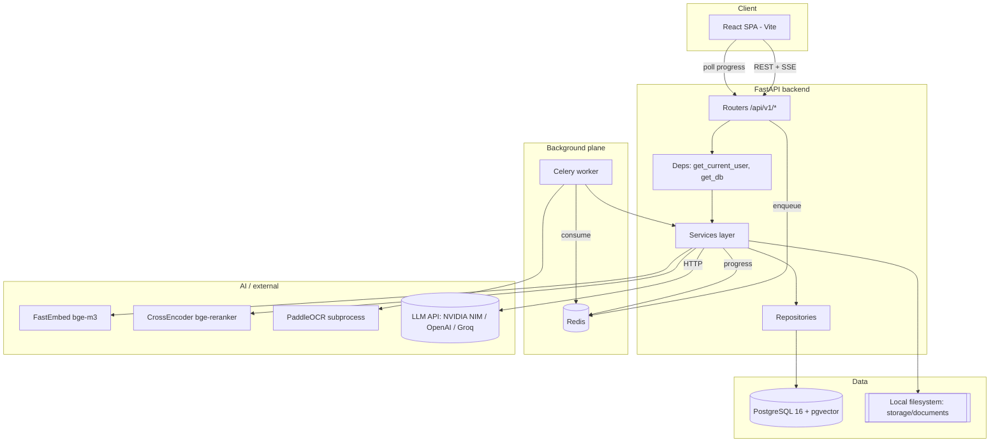

**Two high-level data flows:**
1. **Ingestion (write path, async):** Upload PDF → API stores file + row → enqueues Celery task
   → worker runs the **LangGraph ingestion graph** (parse/OCR → clean → chunk → embed → persist
   → index) → pgvector. Progress streamed to Redis, polled by UI.
2. **Q&A (read path, sync/stream):** User question → embed → pgvector cosine Top-K → CrossEncoder
   rerank → prompt build → LLM → grounded answer with citations (streamed token-by-token for the
   chat UI).

---

## 2. Folder Structure

### Backend `backend/`
```
backend/
├─ Dockerfile                # python:3.12-slim-bookworm; poetry; paddle/torch libs
├─ pyproject.toml / poetry.lock
├─ .env                      # runtime configuration
├─ alembic/                  # DB migrations (versions/001..007) + env.py
└─ app/
   ├─ main.py                # FastAPI factory, CORS, exception handler, lifespan
   ├─ __init__.py            # __version__
   ├─ core/                  # cross-cutting concerns
   │  ├─ config.py           # Settings (pydantic-settings), get_settings()
   │  ├─ logging.py          # setup_logging / get_logger
   │  ├─ exceptions.py       # AppError hierarchy → HTTP codes
   │  ├─ security.py         # PBKDF2 password hash + HS256 JWT (stdlib only)
   │  └─ celery_app.py       # Celery application instance
   ├─ db/
   │  ├─ base.py             # DeclarativeBase + TimestampMixin
   │  └─ session.py          # async engine, get_db(), task_session()
   ├─ models/                # SQLAlchemy ORM (document, chunk, embedding, conversation, user)
   ├─ repositories/          # data-access layer (one per aggregate)
   ├─ schemas/               # Pydantic request/response DTOs
   ├─ services/              # business logic (single source of truth)
   │  └─ llm/                # LLM provider abstraction + OpenAI-compatible client
   ├─ agents/                # TWO layers (see §6):
   │  ├─ base.py             # BaseAgent (multi-agent orchestration)
   │  ├─ base_agent.py       # BaseGraphAgent (LangGraph node contract)
   │  ├─ orchestrator.py, intent.py, legal.py, risk.py, placeholder.py
   │  └─ nodes/              # 9 LangGraph node wrappers
   ├─ graphs/                # LangGraph StateGraph builders (ingestion, rag) + placeholder graph_builder
   ├─ state/                 # GraphState TypedDict
   ├─ tools/                 # ⚠ placeholder BaseTool (no concrete tools)
   ├─ tasks/                 # Celery tasks (ingestion)
   ├─ parsers/               # PdfParser + ExtractionPipeline
   ├─ ocr/                   # PaddleOCR engine + isolated subprocess runner
   ├─ utils/                 # storage.py (local file storage)
   └─ api/
      ├─ deps.py             # get_current_user
      └─ v1/
         ├─ router.py        # aggregates all endpoint routers
         └─ endpoints/       # auth, health, documents, retrieval, chat, agents
```

**Why each backend folder exists**

| Folder | Purpose / what belongs here |
|---|---|
| `core/` | Config, logging, security, exceptions, Celery app — no domain logic. |
| `db/` | Engine/session lifecycle and the declarative base. |
| `models/` | ORM table definitions only (columns, relationships, constraints). |
| `repositories/` | *All* SQL/query logic. Services never write raw queries (except health). |
| `schemas/` | API contracts (validation + serialization). Decoupled from ORM. |
| `services/` | Business logic; the **single source of truth**. Nodes/agents/routers call these. |
| `agents/` + `graphs/` + `state/` | LangGraph orchestration wrappers over services. |
| `tasks/` | Celery entrypoints (background execution). |
| `parsers/` + `ocr/` | Text extraction (digital + scanned). |
| `api/` | HTTP surface (thin routers) + shared dependencies. |

### Frontend `frontend/src/`
```
src/
├─ main.tsx           # React root: QueryClientProvider → AuthProvider → App
├─ App.tsx            # BrowserRouter + Routes (RequireAuth gate)
├─ context/AuthContext.tsx     # user/session state
├─ components/
│  ├─ RequireAuth, Sidebar, Navbar, UploadZone, IngestionProgress,
│  ├─ DocumentCard, StatusBadge, SearchBar, EmptyState, LoadingSpinner
│  ├─ ui/ (Button, Input, Card)
│  └─ charts/ (ScoreGauge used; MonthlyBarChart/CategoryDonut/StatSparkline ⚠ unused)
├─ layouts/AppLayout.tsx       # shell + per-route title/subtitle layouts
├─ pages/            # Dashboard, Documents, Consultation, Analysis, History, Settings,
│                    #  Login  (+ Supervision.tsx, AgentDetail.tsx ✗ NOT ROUTED)
├─ hooks/useDocuments.ts       # React Query hooks
├─ services/         # api (axios), auth, documents, chat, analysis
├─ types/index.ts    # shared TS types
├─ data/mock.ts      # mock data (mostly ⚠ unused; only `suggestions` used)
└─ index.css         # Tailwind v4 theme + utilities
```

---

## 3. Backend Architecture

### FastAPI structure & request lifecycle
- `app/main.py` builds the app via `create_app()`: registers `CORSMiddleware`, an **exception
  handler** for `AppError` (maps `.status_code`/`.message` → JSON `{"detail": ...}`), and mounts
  `api_router` under `settings.api_v1_prefix` (`/api/v1`). A `lifespan` context sets up logging,
  ensures the storage dir, and disposes the DB engine on shutdown.
- `app/api/v1/router.py` mounts routers. **Public:** `health`, `auth`. **Protected** (via
  `dependencies=[Depends(get_current_user)]`): `documents`, `retrieval`, `chat`, `agents`.

**How a request travels:**
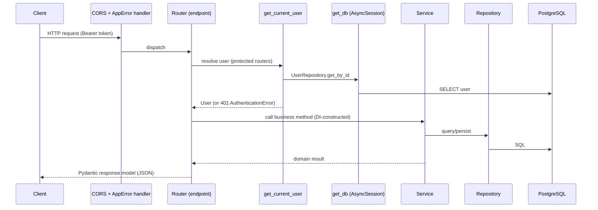

### Dependency Injection
- **Request-scoped DB:** `get_db()` yields an `AsyncSession` from `AsyncSessionLocal`.
- **Service factories:** each router defines `get_*_service(db=Depends(get_db))` returning a
  service constructed with the session. Services accept optional collaborators in their
  constructors (constructor injection) with sensible defaults, enabling test substitution.
- **Process-wide singletons** (`@lru_cache`): `get_settings()`, `get_embedding_service()`,
  `get_ingestion_progress_service()`, `get_langfuse_service()`, `get_paddle_ocr_engine()`,
  `get_llm_provider()`.
- **Auth dependency:** `get_current_user` (in `api/deps.py`) validates the
  `Authorization: Bearer` header.

### Repository Pattern
All SQL lives in `repositories/`:

| Repository | Aggregate | Notable methods |
|---|---|---|
| `DocumentRepository` | documents | `create`, `get_by_id`, `list_all`, `count`, `list_by_statuses`, `delete` |
| `DocumentChunkRepository` | document_chunks | `create_many`, `list_by_document_id`, `delete_by_document_id` |
| `EmbeddingRepository` | chunk_embeddings | `bulk_insert`, `delete_by_document_id`, `count_by_document_id` |
| `RetrievalRepository` | pgvector search | `search_similar(query_embedding, top_k, document_id)` |
| `ConversationRepository` | conversations/messages | CRUD + history |
| `UserRepository` | users | `create`, `get_by_email`, `get_by_id` |
| `VectorRepository` | (helper) | vector-related helpers |

### Services / Routers / Models / Schemas / Config / Middleware / Utilities
- **Services** (`app/services/`): `DocumentService`, `DocumentProcessingService`,
  `IndexingService`, `EmbeddingService`, `RetrievalService`, `RerankerService`,
  `GeneratorService`, `ConversationService`, `AuthService`, `IngestionProgressService`,
  `LangfuseService`, plus helpers (`chunker`, `text_cleaner`, `prompt_builder`,
  `context_formatter`) and `llm/` provider abstraction.
- **Routers** (`app/api/v1/endpoints/`): thin — parse request, call one service, return a schema.
- **Models** (`app/models/`): ORM only (see §4).
- **Schemas** (`app/schemas/`): Pydantic v2 DTOs (`from_attributes=True` where mapping ORM).
- **Configuration:** `Settings` (pydantic-settings) loads env/`.env`; exposes computed
  `database_url` (asyncpg) and `database_url_sync` (psycopg2 for Alembic).
- **Middleware:** only `CORSMiddleware` (open in development) + a global `AppError` exception
  handler. No custom auth middleware — auth is a router-level dependency.
- **Utilities:** `utils/storage.py` (`DocumentStorage` — async file save/delete, `is_pdf_content`
  magic-byte check).

---

## 4. Database

PostgreSQL 16 with the **`vector`** extension. Schema is managed by Alembic
(`versions/001`→`007`). Async access via `asyncpg`; Alembic uses sync `psycopg2`.

### Tables

**`users`** (migration 007) — application accounts.
| Column | Type | Notes |
|---|---|---|
| id | UUID | PK |
| email | VARCHAR(320) | **unique index** `ix_users_email` |
| hashed_password | VARCHAR(255) | PBKDF2 hash string |
| full_name | VARCHAR(255) | nullable |
| role | VARCHAR(50) | default `Juriste` |
| is_active | BOOLEAN | default `true` |
| created_at / updated_at | TIMESTAMPTZ | server default `now()` |

**`documents`** (001, extended by 002/003/005) — uploaded PDF metadata + lifecycle.
| Column | Type | Notes |
|---|---|---|
| id | UUID | PK |
| original_filename | VARCHAR(255) | |
| stored_filename | VARCHAR(255) | **unique** |
| file_path | VARCHAR(512) | on-disk path |
| mime_type | VARCHAR(100) | always `application/pdf` |
| file_size | BIGINT | bytes |
| upload_date | TIMESTAMPTZ | `now()` |
| status | ENUM `document_status` | `uploaded/processing/processed/failed` (+ legacy `completed`) |
| extracted_text | TEXT | cleaned full text |
| page_count | INTEGER | nullable |
| extraction_method | ENUM `extraction_method` | `pdf_parser/paddle_ocr` |
| index_status | ENUM `index_status` | `not_indexed/indexing/indexed/failed` |
| indexed_at | TIMESTAMPTZ | nullable |
| indexed_chunk_count | INTEGER | nullable |
| embedding_model | VARCHAR(255) | nullable |

**`document_chunks`** (004) — semantic chunks.
| Column | Type | Notes |
|---|---|---|
| id | UUID | PK |
| document_id | UUID | FK→documents `ON DELETE CASCADE`, **indexed** |
| chunk_index | INTEGER | |
| text | TEXT | |
| metadata (`metadata_`) | JSONB | default `{}` |
| created_at | TIMESTAMPTZ | |
| — | — | **UNIQUE(document_id, chunk_index)** |

**`chunk_embeddings`** (005) — vectors (denormalized for retrieval without joins).
| Column | Type | Notes |
|---|---|---|
| id | UUID | PK |
| document_id | UUID | FK→documents CASCADE, **indexed** `ix_chunk_embeddings_document_id` |
| chunk_id | UUID | FK→document_chunks CASCADE, **UNIQUE** `uq_chunk_embeddings_chunk_id` |
| filename | VARCHAR(255) | denormalized |
| page_numbers | JSONB | default `[]` |
| extraction_method | VARCHAR(50) | nullable |
| upload_date | TIMESTAMPTZ | |
| chunk_index | INTEGER | |
| chunk_text | TEXT | denormalized chunk text |
| embedding_model | VARCHAR(255) | |
| embedding | **VECTOR(1024)** | pgvector |
| created_at / updated_at | TIMESTAMPTZ | |
| — | — | **HNSW index** `ix_chunk_embeddings_embedding_hnsw USING hnsw (embedding vector_cosine_ops)` |

**`conversations`** (006) — chat sessions: `id`, `title`, `created_at`, `updated_at`.

**`messages`** (006) — `id`, `conversation_id` (FK→conversations CASCADE, **indexed**), `role`
ENUM `message_role` (`user/assistant`), `content` TEXT, `created_at`, `metadata` JSONB default
`{}`.

**Enums:** `document_status`, `extraction_method`, `index_status`, `message_role`.

### ER Diagram
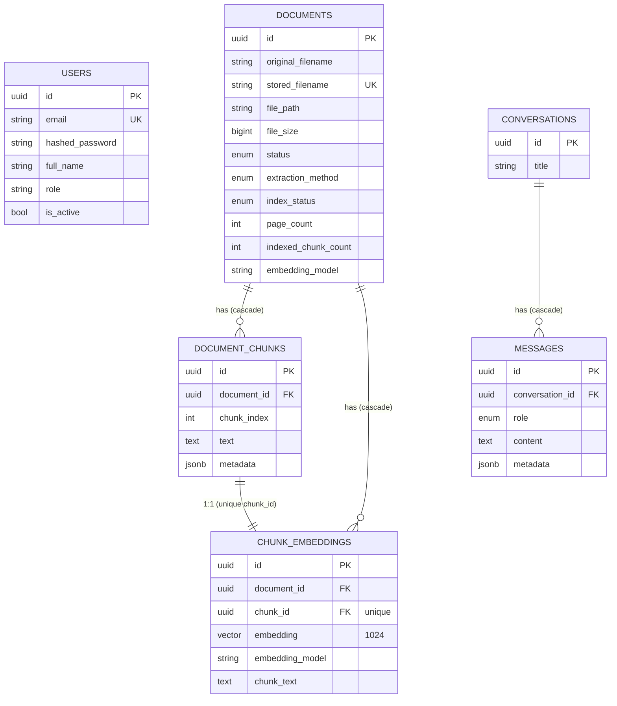
> Note: `users` is currently standalone — documents/conversations are **not** foreign-keyed to a
> user (no per-user ownership yet). See §13.

### pgvector integration
- Extension enabled by migration 005 (`CREATE EXTENSION IF NOT EXISTS vector`).
- Column type `Vector(1024)` (`pgvector.sqlalchemy.Vector`), matching `EMBEDDING_DIMENSION`
  (bge-m3 / e5-large = 1024).
- **HNSW** cosine index for ANN search.
- Query (in `RetrievalRepository.search_similar`): `distance = embedding.cosine_distance(query_embedding)`,
  `similarity = 1 - distance`, `ORDER BY distance LIMIT top_k`, filtered to
  `Document.index_status == INDEXED` (optional `document_id` filter).

---

## 5. RAG Pipeline (stage by stage)

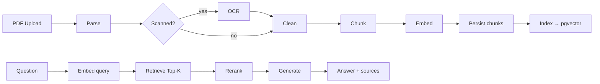

| Stage | Input | Output | Class / Service | Repository | DB interaction |
|---|---|---|---|---|---|
| **Upload** | `UploadFile` | `Document` row + stored file + `task_id` | `DocumentService.upload` | `DocumentRepository` | INSERT `documents` (status `uploaded`); file → `storage/documents` |
| **Parse** | `file_path` | text + page_count + `pdf_parser` method | `ParserNode` → `PdfParser` (PyMuPDF `fitz`) | — | none |
| **OCR** (conditional) | `file_path` | text + `paddle_ocr` method | `OCRNode` → `run_paddle_ocr_subprocess` / `PaddleOcrEngine` | — | none (isolated subprocess) |
| **Clean** | raw text/pages | normalized text | `CleaningNode` → `text_cleaner.clean_text/clean_pages` | — | none |
| **Chunk** | cleaned text | `ChunkDraft[]` (size 900 / overlap 175) | `ChunkingNode` → `SemanticChunker` | — | none (in-memory) |
| **Persist** | chunk drafts | `document_chunks` rows; status `processed` | graph `persist_step` → `DocumentProcessingService.finalize_chunks` | `DocumentChunkRepository.create_many` | INSERT chunks; UPDATE document |
| **Embed** | chunk texts | `list[vector]` | `EmbeddingNode` → `EmbeddingService.embed_batch` (FastEmbed bge-m3) | — | none |
| **Index** | chunks (+ reused vectors) | `chunk_embeddings` rows; `index_status=indexed` | `IndexingNode` → `IndexingService.index_document` | `EmbeddingRepository.bulk_insert` | DELETE old + INSERT vectors; UPDATE document |
| **Retrieve** | query text | Top-K `RetrievalHit[]` | `RetrievalService.retrieve_hits` → `EmbeddingService.embed_query` | `RetrievalRepository.search_similar` | pgvector cosine SELECT |
| **Rerank** | query + hits | `RerankedHit[]` (final_k) | `RerankerService.rerank_hits` (CrossEncoder bge-reranker-v2-m3) | — | none |
| **Generate** | question + reranked chunks | grounded answer + sources + metadata | `GeneratorService.generate_from_chunks` → `PromptBuilder` + LLM provider | — | none (HTTP to LLM) |
| **Response** | answer | JSON / SSE stream | endpoint (`/chat/*`) | — | conversation path writes `messages` |

Performance note: `IndexingService.index_document` accepts `precomputed_embeddings` so the
ingestion graph reuses `EmbeddingNode` vectors instead of re-embedding (identical result, one
fewer embedding pass).

---

## 6. Current LangGraph Integration

**Two distinct abstractions coexist (do not conflate them):**

| Layer | Base class | State object | Where used |
|---|---|---|---|
| Multi-agent orchestration | `agents/base.py` `BaseAgent` | `AgentContext` / `AgentResult` | `/agents/*` |
| LangGraph nodes | `agents/base_agent.py` `BaseGraphAgent` | `state/graph_state.py` `GraphState` | ingestion + rag graphs |

- **`BaseGraphAgent`** — abstract: `name`, `description`, `async execute(state) -> GraphState`.
  All 9 nodes implement it.
- **`GraphState`** (`TypedDict, total=False`): `document_id, filename, extracted_text,
  cleaned_text, chunks, embeddings, retrieved_chunks, reranked_chunks, user_question,
  llm_response, metadata, errors`. Actively used (its "future" docstring is **stale**).
- **`GraphBuilder`** (`graphs/graph_builder.py`) — ✗ **placeholder**:
  `add_node/add_edge/set_entry_point` fluent stubs; `build()` raises `NotImplementedError`;
  **zero runtime callers**. Real graphs use LangGraph's native `StateGraph` directly — the name
  is misleading.

**Nodes** (`agents/nodes/`, all thin wrappers over services): `ParserNode, OCRNode, CleaningNode,
ChunkingNode, EmbeddingNode, IndexingNode` (ingestion) and `RetrievalNode, RerankerNode,
GeneratorNode` (RAG). Shared helpers in `_state_utils.py`.

**Current graphs**

| Graph | Builder | Topology | Wired to | Status |
|---|---|---|---|---|
| Ingestion | `build_ingestion_graph` | `parser → {ocr\|cleaning} → cleaning → chunking → embedding → persist → {indexing\|END}` | `DocumentProcessingService.process_document` (via Celery) | ✓ **Production** |
| RAG | `build_rag_graph` | `embedding → retrieval → reranker → generator → END` | **only** `POST /chat/query` | ⚠ Partially used |

- Both graphs share a **transient-only** retry policy (`app/graphs/retry.py::transient_retry_policy`,
  3 attempts). It retries only recoverable failures (timeouts, 429, 5xx, `AppError.retryable`,
  network blips) and fails fast on permanent errors (validation, not-found, auth/config) so retries
  are never wasted. Falls back to attempt-count-only on older LangGraph versions.
- Ingestion graph applies the shared policy on parse/ocr/embedding/persist/indexing; conditional
  routing via `ExtractionPipeline.is_scanned_pdf`; `PdfParseError` → OCR fallback; `IndexingError`
  tolerated (document stays *processed*); optional `on_stage` callback publishes progress to Redis.
- RAG graph's `EmbeddingNode` is a structural no-op for queries (query embedding happens inside
  `RetrievalService`).
- **Observability bridge:** `LangfuseService.trace_node()` wraps every node in both graphs (no-op
  unless `LANGFUSE_ENABLED`).

**How LangGraph integrates with services:** nodes hold injected services and delegate; graphs are
built per-request/per-task from the `AsyncSession`. **No business logic lives in nodes/graphs.**

⚠ **Not integrated:** the multi-agent orchestrator does **not** use LangGraph; the primary chat UI
uses `/chat/stream` which bypasses the RAG graph entirely (calls `GeneratorService.stream_answer`
directly).

---

## 7. AI Components

| Component | Implementation | Interaction |
|---|---|---|
| **Embedding model** | `EmbeddingService` — FastEmbed ONNX `BAAI/bge-m3` (fallback `intfloat/multilingual-e5-large`), dim 1024, process singleton, `embed_query` adds `query:` prefix for E5 | Used by ingestion (`embed_batch`) and retrieval (`embed_query`) |
| **Retriever** | `RetrievalService` + `RetrievalRepository` (pgvector cosine Top-K, `INDEXED` only) | Consumes query embedding → hits |
| **Reranker** | `RerankerService` — FastEmbed CrossEncoder `BAAI/bge-reranker-v2-m3` (fallback MiniLM), runs in `asyncio.to_thread` | Reorders retrieval hits, keeps `final_k` |
| **Generator** | `GeneratorService` — retrieve→rerank→`PromptBuilder`→LLM; `answer_question`, `generate_from_chunks`, `stream_answer` (SSE). `stream_answer` **guarantees a non-empty answer**: if the stream emits no fragments it falls back to a blocking `complete()`, then to the grounded no-answer message, and always includes the final `answer` in the `done` event | Central RAG engine; reused by chat, conversations, agents |
| **LLM provider layer** | `BaseLLMProvider` (shared OpenAI-compatible HTTP + bounded exponential-backoff retries on transient errors + granular httpx timeout connect 15s/read 300s + SSE parsing + professional error mapping). Concrete subclasses `OpenAIProvider`, `GroqProvider`, `NvidiaProvider`, `OpenRouterProvider` (in `services/llm/providers.py`) only set defaults/headers. `OpenAICompatibleProvider` retained as a thin alias for backward compatibility | HTTP `/chat/completions` |
| **Provider factory** | `get_llm_provider` — env-driven registry (`services/llm/factory.py`). `LLM_PROVIDER` selects the provider; the API key resolves from a provider-specific env var (`OPENAI_API_KEY`/`GROQ_API_KEY`/`NVIDIA_API_KEY`/`OPENROUTER_API_KEY`) then falls back to generic `LLM_API_KEY`. Adding a provider = one registry entry | — |
| **Conversation memory** | `ConversationService` — persists messages; `load_history` (limit `CONVERSATION_HISTORY_LIMIT=10`) injected into prompt (history loaded *before* current turn) | Feeds `GeneratorService.answer_question(history=...)` |
| **Multi-Agent Orchestrator** | `AgentOrchestrator` + `IntentRouter` (keyword rules) — selects `LegalAgent`/`FinanceAgent`/`ComplianceAgent`, shares one `GeneratorService`/RAG result | `POST /agents/query` (⚠ not called by frontend) |
| **LegalAgent** | `LegalAgent.analyze` — `GeneratorService.answer_question(system_prompt=LEGAL_SYSTEM_PROMPT, document_id, history)` + `RuleBasedRiskClassifier` (rule-based risk level/findings/missing info/recommendations) | `POST /agents/legal/analyze` (used by Analysis page) |
| **Finance/Compliance agents** | ✗ `placeholder.py` — generic RAG passthrough, `status="placeholder"` | Selected by intent only |

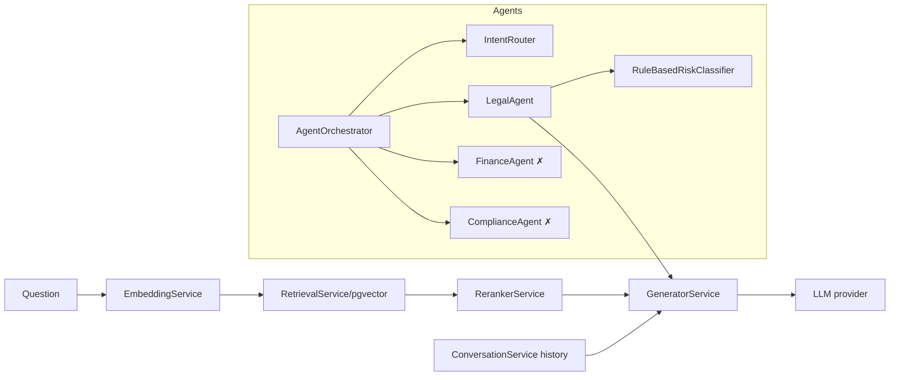

---

## 8. API Documentation

Base prefix: `/api/v1`. All `documents`, `retrieval`, `chat`, `agents` routers require
`Authorization: Bearer <JWT>`.

### Auth (public)
| Method / URL | Request | Response | Service | DB |
|---|---|---|---|---|
| POST `/auth/register` | `{email, password, full_name?, role?}` | `201 {access_token, token_type, user}` | `AuthService.register` | INSERT `users` |
| POST `/auth/login` | `{email, password}` | `{access_token, token_type, user}` | `AuthService.authenticate` | SELECT `users` |
| GET `/auth/me` | — (Bearer) | `UserResponse` | `get_current_user` | SELECT `users` |

### Health (public)
| Method / URL | Request | Response | Service | DB |
|---|---|---|---|---|
| GET `/health` | — | `{status, app_name, version, environment, timestamp, database}` | inline | `SELECT 1` |

### Documents (protected)
| Method / URL | Request | Response | Service | DB |
|---|---|---|---|---|
| POST `/documents` | multipart `file` | `202 DocumentUploadResponse {document_id, task_id, status, filename, message}` | `DocumentService.upload` → Celery enqueue | INSERT `documents`; Redis queued |
| GET `/documents` | `skip,limit` | `DocumentListResponse` | `DocumentService.list_documents` | SELECT + COUNT |
| GET `/documents/{id}` | — | `DocumentResponse` | `DocumentService.get_document` | SELECT |
| DELETE `/documents/{id}` | — | `204` | `DocumentService.delete_document` | DELETE (+ file) |
| GET `/documents/{id}/chunks` | — | `DocumentChunkListResponse` | `DocumentProcessingService.get_chunks` | SELECT chunks |
| GET `/documents/{id}/status` | — | `DocumentStatusResponse` | `DocumentProcessingService.get_status` | SELECT |
| GET `/documents/{id}/progress` | — | `DocumentProgressResponse` (stage, %, timeline, error) | `DocumentService.get_progress` | Redis (fallback DB) |
| POST `/documents/{id}/reprocess` | — | `202 DocumentUploadResponse` | `DocumentService.reprocess` | Celery enqueue |
| POST `/documents/{id}/index` | — | `DocumentIndexResponse` | `IndexingService.index_document` | INSERT vectors |
| DELETE `/documents/{id}/index` | — | `DocumentIndexResponse` | `IndexingService.delete_index` | DELETE vectors |
| GET `/documents/{id}/index-status` | — | `DocumentIndexStatusResponse` | `IndexingService.get_index_status` | SELECT/COUNT |
| POST `/documents/reindex` | — | `DocumentReindexResponse` | `IndexingService.reindex_all` | bulk re-index |

### Retrieval (protected)
| Method / URL | Request | Response | Service | DB |
|---|---|---|---|---|
| POST `/retrieve` | `{query, top_k?}` | `RetrieveResponse{query, top_k, results[]}` | `RetrievalService.retrieve` | pgvector SELECT |
| POST `/retrieve/rerank` | `{query, top_k?, final_k?}` | `RerankResponse{..., reranker_model, results[]}` | `RerankerService.retrieve_and_rerank` | pgvector SELECT |

### Chat (protected)
| Method / URL | Request | Response | Service | DB |
|---|---|---|---|---|
| POST `/chat/query` | `ChatQueryRequest{question, document_id?, top_k?, final_k?, temperature?, max_tokens?}` | `ChatQueryResponse{answer, sources[], metadata}` | `build_rag_graph` → nodes | pgvector SELECT; LLM |
| POST `/chat/stream` | `ChatQueryRequest` | **SSE** events `data:{type:sources\|delta\|done\|error}` | `GeneratorService.stream_answer` | pgvector SELECT; LLM stream |
| POST `/chat/document` | `ChatQueryRequest` | `ChatDocumentResponse{html, sources[], metadata}` — a complete, self-contained HTML document (printable to PDF / downloadable) | `GeneratorService.generate_document` (grounded, `DOCUMENT_SYSTEM_INSTRUCTIONS` prompt, larger token budget) | pgvector SELECT; LLM |
| POST `/chat/conversations` | `{title?}` | `201 ConversationResponse` | `ConversationService.create_conversation` | INSERT |
| GET `/chat/conversations` | `skip,limit` | `ConversationListResponse` | `list_conversations` | SELECT |
| GET `/chat/conversations/{id}` | — | `ConversationResponse` (+messages) | `get_conversation` | SELECT |
| DELETE `/chat/conversations/{id}` | — | `204` | `delete_conversation` | DELETE cascade |
| POST `/chat/conversations/{id}/messages` | `ConversationMessageRequest{content, top_k?, ...}` | `ConversationMessageResponse{user_message, assistant_message, answer, sources, metadata}` | `ConversationService.send_user_message` → `GeneratorService.answer_question` | INSERT messages; pgvector; LLM |

### Agents (protected)
| Method / URL | Request | Response | Service | DB |
|---|---|---|---|---|
| POST `/agents/query` | `AgentQueryRequest` | `AgentQueryResponse{selected_agents, intent, responses[]}` | `AgentOrchestrator.query` | pgvector; LLM |
| POST `/agents/legal/analyze` | `LegalAnalyzeRequest{question, document_id?, conversation_id?, ...}` | `LegalAnalysisResponse{analysis, risk_level, missing_information[], sources[], recommendations[], metadata}` | `LegalAgent.analyze` (+history) | pgvector; LLM |

**Typical flow example (`/chat/stream`):** endpoint → `GeneratorService.stream_answer` →
`_retrieve_and_rerank` (embed → pgvector → CrossEncoder) → `_prepare_prompt` → yields `sources`,
then LLM `stream_complete` deltas, then `done` (includes the full `answer` as a fallback).

**Document scoping (all chat endpoints):** `ChatQueryRequest` accepts an optional `document_id`.
When set, retrieval is filtered to that single document (`RetrievalService.search_similar(...,
document_id=...)`); when omitted/null, answers are grounded on the **entire** library (default).
`/chat/query` propagates it via `GraphState.document_id` (read by `RetrievalNode`); `/chat/stream`
and `/chat/document` pass it straight to `GeneratorService`. The Consultation UI exposes this as a
scope selector ("Tous les documents" vs a specific indexed document) shown in the chat header.

**Multi-document coverage (all-documents mode):** plain Top-K concentrates on whichever document has
the most matching chunks, so library-wide questions used to answer from a single file. In
`GeneratorService._retrieve_and_rerank`, when `document_id is None`, the candidate pool is widened
(`multi_doc_candidate_k`, default 40, capped at the SQL limit of 50), the whole pool is reranked, then
`_diversify_by_document` caps how many chunks any single document contributes
(`multi_doc_per_document_cap`, default 2) before keeping `multi_doc_final_k` (default 8) chunks —
back-filling remaining slots with the best leftovers. Single-document and graph (`/chat/query`) paths
are unchanged. Settings live in `core/config.py`.

**Duplicate cleanup:** `python -m app.scripts.dedupe_documents` (dry-run; `--apply` to delete) removes
documents sharing the same `original_filename` + `file_size` (no content-hash column exists), keeping
one canonical copy (INDEXED first, then earliest upload). Deletion cascades to chunks/embeddings and
removes the stored PDF. Duplicate uploads otherwise skew retrieval toward the duplicated files.

**Document generation mode (`/chat/document`):** same grounded retrieve → rerank pipeline as the
chat, but `GeneratorService.generate_document` swaps in `DOCUMENT_SYSTEM_INSTRUCTIONS` (asks the
model for a full, self-contained HTML5 document with inline CSS) and a larger completion budget
(`max(LLM_MAX_TOKENS, 6000)`). Output is normalised by `_extract_html` (strips markdown fences,
wraps prose when needed). The frontend detects document intent client-side (`wantsDocument` in
`services/chat.ts`), renders the HTML in a sandboxed `<iframe>`, and offers **Print → PDF**
(`window.print`) and **Download `.html`** — no server-side PDF dependency. Default model for rich
output is `anthropic/claude-sonnet-4.5` via OpenRouter (env-driven, `LLM_MODEL`).

### Error handling & response envelope (enterprise UX)
All errors are normalized by global handlers in `app/main.py` so clients get a consistent,
professional, non-technical payload and **never** a stack trace or internal detail:

```json
{ "detail": "<human-readable message>", "code": "<machine_code>", "retryable": true }
```

- `AppError` (and subclasses) → their own status + professional `message`; technical `detail` is
  logged only. `LLMProviderError` maps HTTP 429/5xx/timeouts/malformed responses to friendly
  French messages and a `retryable` flag.
- `RequestValidationError` → `422` with a clean field message (no raw pydantic dump).
- Any unhandled `Exception` → `500` generic message (`code: internal_error`), full traceback
  logged server-side only.
- `/chat/stream` emits errors as an SSE `error` event carrying `message`/`code`/`retryable`
  (never leaking internals).

---

## 9. Frontend Architecture

- **Stack:** React 18 + TypeScript + Vite, Tailwind CSS v4, React Router, TanStack React Query,
  Axios, react-hook-form, lucide-react, Recharts.
- **Bootstrap (`main.tsx`):** `QueryClientProvider` (staleTime 30s, retry 1, no refetch-on-focus)
  → `AuthProvider` → `App`.
- **Routing (`App.tsx`):** `BrowserRouter`. Public: `/login` (and `/`→`/login`). Protected under
  `<RequireAuth>`: `/dashboard`, `/consultation`, `/documents`, `/analysis/:id`, `/history`,
  `/settings`; catch-all → `/dashboard`. ✗ `Supervision.tsx` and `AgentDetail.tsx` **exist but
  are not imported/routed** (dead pages).
- **Auth (`context/AuthContext.tsx`, `RequireAuth`):** token in `localStorage`
  (`legallink_token`); on mount, hydrates via `GET /auth/me`; `login/register/logout`;
  `RequireAuth` shows a spinner during hydration then redirects unauthenticated users to `/login`.
- **API client (`services/api.ts`):** axios `baseURL = VITE_API_BASE_URL ?? '/api/v1'`, timeout
  **600s**; request interceptor injects Bearer token; response interceptor on **401** clears token
  and hard-redirects to `/login` (except `/auth/*`).
- **Services:** `auth.ts` (`/auth/*`), `documents.ts` (`/documents*`), `chat.ts` (`askQuestion`
  ⚠ unused, `streamQuestion` SSE via `fetch`), `analysis.ts` (`/agents/legal/analyze`).
- **Hooks (`useDocuments.ts`):** `useDocuments`, `useRecentActivity`, `useLegalAnalysis(id)`,
  `useUploadDocument`, `useDocumentProgress(id)` (polls every 1.5s until terminal).
- **State management:** React Query for server state (keys `['documents']`, `['activity']`,
  `['legal-analysis', id]`, `['document-progress', id]`); local `useState` per page; no
  Redux/Zustand. Chat messages are ephemeral (in-memory).
- **Pages:** Dashboard/Documents/History/Analysis/Settings/Login/Consultation are **wired to the
  backend**; `mock.ts` is largely unused (only chat `suggestions`); some chart components and the
  History period filter are cosmetic.
- **Communication with FastAPI:** REST via axios; SSE via `fetch` + `ReadableStream` for streaming
  chat; dev requests proxied `/api` → `http://localhost:8000`.

---

## 10. Sequence Diagrams

**Uploading a document**
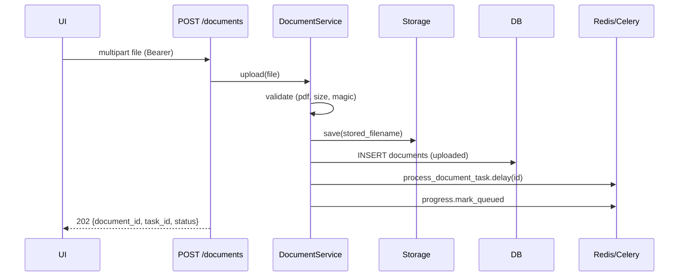

**Document indexing (background ingestion)**
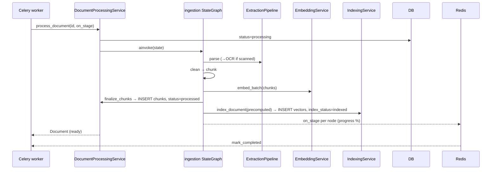

**Chat with the AI (streaming)**
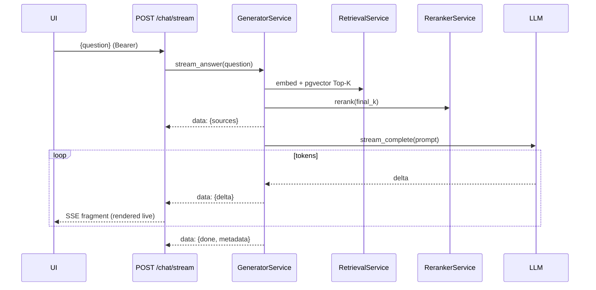

**Semantic retrieval**
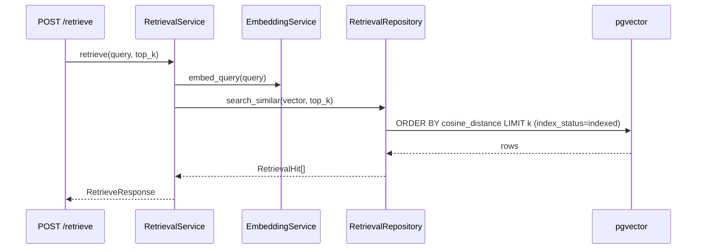

**Multi-agent request**
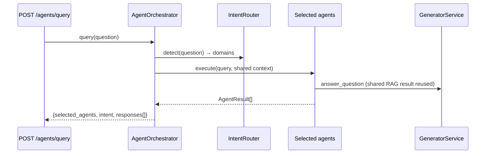

---

## 11. Current Project Workflow (full lifecycle + classes)

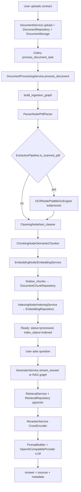

Progress across ingestion is written to Redis by `IngestionProgressService` (via the graph's
`on_stage` hook) and surfaced through `GET /documents/{id}/progress`, which the `IngestionProgress`
React component polls.

---

## 12. Design Patterns

| Pattern | Where | Why |
|---|---|---|
| **Layered architecture** | routers → services → repositories → models | Separation of concerns, testability |
| **Repository** | `app/repositories/*` | Isolate all persistence/SQL; swap/mocks |
| **Dependency Injection** | FastAPI `Depends`, service constructors | Loose coupling, testability |
| **Service layer / single source of truth** | `app/services/*` | Business logic reused by nodes/agents/routers with zero duplication |
| **Factory** | `get_llm_provider`, service `get_*_service`, `create_app` | Central construction from config |
| **Strategy** | LLM providers behind `LLMProvider` Protocol; `RiskClassifier` Protocol; extraction (digital vs OCR) | Interchangeable implementations |
| **Adapter/Wrapper** | LangGraph nodes wrapping services; `OpenAICompatibleProvider` adapting OpenAI/Groq/NIM | Uniform interface over heterogeneous back-ends |
| **Pipeline / Chain (state machine)** | LangGraph `StateGraph` (ingestion, rag) | Composable, retryable, conditional stages |
| **Singleton (cached)** | `@lru_cache` on settings, embedding/reranker/LLM/progress/langfuse | Expensive resources loaded once per process |
| **Template Method** | `BaseAgent._rag_answer`; `BaseGraphAgent.execute` contract | Shared behavior with specialized steps |
| **DTO / Schema mapping** | Pydantic `schemas/*` | Validation + decoupling API from ORM |
| **Observer / callback** | `on_stage` progress hook; Langfuse `trace_node` | Cross-cutting instrumentation without touching logic |
| **Producer/Consumer (task queue)** | Celery + Redis | Offload long ingestion from the request path |
| **Null Object / graceful degradation** | `LangfuseService` no-op when disabled; `IngestionProgressService` no-op without Redis | Optional dependencies never break the app |

---

## 13. Current Limitations

**Placeholders / stubs (✗)**
- `graphs/graph_builder.py` `GraphBuilder.build()` raises `NotImplementedError`; unused
  (misleading name).
- `tools/` + `BaseTool` — contract only, no concrete tools.
- `FinanceAgent`, `ComplianceAgent` — generic RAG passthroughs (`status="placeholder"`).
- Frontend `Supervision.tsx`, `AgentDetail.tsx` — exist but **not routed**; unused chart
  components (`MonthlyBarChart`, `CategoryDonut`, `StatSparkline`) and most of `mock.ts`.

**Partial / temporary (⚠)**
- Chat exists in **three** paths (`/chat/query` via RAG graph, `/chat/stream` direct, conversation
  messages) — the RAG **graph** is only used by `/chat/query`; the UI uses `/chat/stream`
  (bypasses LangGraph).
- Multi-agent orchestrator (`/agents/query`) is implemented but **not called by the frontend**.
- `LegalAgent.execute()` (orchestrator path) does **not** forward `document_id` (the direct
  `/agents/legal/analyze` path does).
- `IntentRouter` uses word-boundary matching while agents' `can_handle` use substring matching
  (inconsistent).
- RAG-graph `EmbeddingNode` is a structural no-op for queries.
- Frontend `DocumentItem.score`/`type`/`agents` are **hardcoded placeholders** in `documents.ts`
  (not real backend fields); Analysis `ScoreGauge` maps risk→score heuristically.
- Streaming chat is **not persisted** (ephemeral); conversation persistence exists but the UI
  doesn't use it.
- History "period" filter and Consultation paperclip are non-functional UI.
- Settings profile is read-only (no update endpoint).

**Recently hardened (production-readiness pass)**
- ✓ Q→A reliability: `stream_answer` can no longer produce a blank reply (blocking fallback +
  no-answer fallback + `answer` in the `done` event; the frontend renders it if no fragments
  arrived).
- ✓ Provider layer: `BaseLLMProvider` + `OpenAIProvider`/`GroqProvider`/`NvidiaProvider`/
  `OpenRouterProvider`; OpenRouter is ready — set `LLM_PROVIDER=openrouter` + `OPENROUTER_API_KEY`
  (no code changes). Bounded retries on transient errors.
- ✓ Enterprise error handling: consistent `{detail, code, retryable}` envelope; validation and
  catch-all handlers; no stack traces/technical terms exposed to users.
- ✓ LangGraph: shared transient-only retry policy across both graphs.

**Technical debt**
- **No user ownership:** `documents`/`conversations` have no FK to `users`; every authenticated
  user sees all documents (multi-tenancy gap).
- Default `JWT_SECRET` in config must be overridden in production; CORS is fully open in dev.
- Stale docstrings ("future"/"architecture preparation") on live components (`GraphState`,
  `BaseGraphAgent`).
- Denormalized `chunk_embeddings` (filename/chunk_text duplicated) — intentional for retrieval
  speed but a consistency risk on edits.
- `askQuestion` (non-streaming client) is dead code.

---

## 14. Roadmap (grounded in the current code)

**✓ Already implemented**
- Auth (register/login/me, JWT, PBKDF2), protected routers.
- PDF upload + local storage; async ingestion via Celery/Redis with live progress.
- Digital parse (PyMuPDF) + conditional PaddleOCR (isolated subprocess).
- Cleaning, semantic chunking, embeddings (bge-m3), pgvector storage + HNSW.
- Retrieval (cosine Top-K), CrossEncoder reranking, grounded generation (+ streaming SSE).
- Conversation persistence + memory; LegalAgent + rule-based risk; Langfuse tracing (optional).
- LangGraph ingestion (production) and RAG graph; React SPA (dashboard, documents, chat, analysis,
  history, settings).

**⚠ Partially implemented**
- Multi-agent orchestrator (backend only, unused by UI); Finance/Compliance placeholders.
- RAG graph used only by `/chat/query`; UI uses direct streaming.
- Conversation UI (backend ready, frontend uses ephemeral chat).
- Generic `GraphBuilder` (stub).

**✗ Not implemented**
- Per-user data ownership / multi-tenancy (documents ↔ users FK, per-user filtering).
- Concrete LangGraph tools; agent-as-graph integration.
- Streaming for conversations/agents endpoints.
- Profile update, Supervision/AgentDetail pages, analytics charts wired to real data.

**Recommended next steps (logical order):**
1. **User ownership & authorization** — add `user_id` FKs + per-user filtering (foundational for
   everything else).
2. **Unify chat** — persist streamed answers into conversations; make the UI use conversation
   endpoints; consider streaming conversation/agent responses.
3. **Wire the multi-agent orchestrator into the UI** (Analysis/Consultation), and promote
   Finance/Compliance from placeholders.
4. **Harden production config** — real `JWT_SECRET`, scoped CORS, secrets management.
5. **Finish/trim frontend** — route or delete Supervision/AgentDetail, wire charts to real
   metrics, remove dead mock/`askQuestion`.
6. **Optional:** migrate `/chat/stream` onto a streaming-capable LangGraph path to consolidate on
   one orchestration model.

---

## 15. Final Architecture Diagram

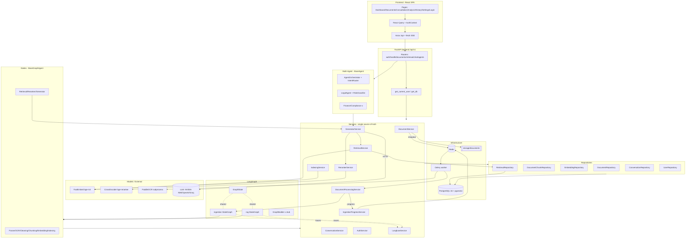
