# LegalLink — Complete Technical Architecture Documentation

> **Scope:** This documents the system *exactly as it exists today*. Where a component is a
> placeholder, stub, or unused, it is explicitly flagged with ⚠ (partial) or ✗ (not
> implemented / unused).
>
> **Maintenance:** This file MUST be updated whenever the architecture changes (new tables,
> services, endpoints, graphs/nodes, agents, frontend routes/pages, infra services, or data
> flows). See `.cursor/rules/keep-architecture-doc-updated.mdc`.
>
> _Last verified: 2026-07-28 (per-contract generated documents in Analysis page)._

---

## Table of Contents
1. [Overall Architecture](#1-overall-architecture)
2. [Folder Structure](#2-folder-structure)
3. [Backend Architecture](#3-backend-architecture)
4. [Database](#4-database)
5. [RAG Pipeline](#5-rag-pipeline-stage-by-stage)
6. [Current LangGraph Integration](#6-current-langgraph-integration)
7. [AI Components](#7-ai-components)
8. [API Documentation](#8-api-documentation)
9. [Frontend Architecture](#9-frontend-architecture)
10. [Sequence Diagrams](#10-sequence-diagrams)
11. [Current Project Workflow](#11-current-project-workflow-full-lifecycle--classes)
12. [Design Patterns](#12-design-patterns)
13. [Current Limitations](#13-current-limitations)
14. [Roadmap](#14-roadmap-grounded-in-the-current-code)
15. [Final Architecture Diagram](#15-final-architecture-diagram)

---

## 1. Overall Architecture

LegalLink is an **AI platform for analysing legal contracts** (RAG over uploaded PDFs). It is a
classic layered system with an asynchronous processing plane.

**Runtime processes (Docker Compose):**

| Service | Image / Command | Role |
|---|---|---|
| `db` | `pgvector/pgvector:pg16` | PostgreSQL 16 + pgvector extension |
| `redis` | `redis:7-alpine` | Celery broker/result backend + ingestion progress + durable chat event store |
| `backend` | `uvicorn app.main:app` | FastAPI HTTP API (ASGI) |
| `worker` | `celery -A app.core.celery_app:celery_app worker` | Background ingestion, chat/agent generation and contract analysis |
| `frontend` (dev) | `vite` | React SPA, proxies `/api` → backend:8000 |

**Layering (backend):** Routers → Services → Repositories → SQLAlchemy Models →
PostgreSQL/pgvector. Long-running AI orchestration is expressed as **LangGraph `StateGraph`**
workflows whose nodes are thin wrappers over the same services.

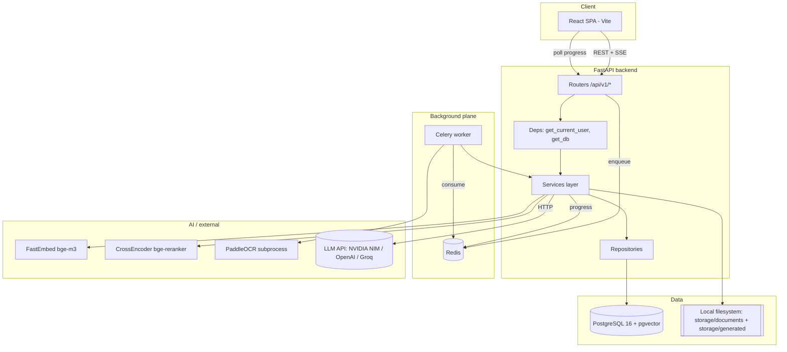
```mermaid
flowchart TB
  subgraph Client
    UI[React SPA - Vite]
  end
  subgraph API[FastAPI backend]
    R[Routers /api/v1/*]
    DEP[Deps: get_current_user, get_db]
    SVC[Services layer]
    REPO[Repositories]
  end
  subgraph Async[Background plane]
    RED[(Redis)]
    CEL[Celery worker]
  end
  subgraph Data
    PG[(PostgreSQL 16 + pgvector)]
    FS[[Local filesystem: storage/documents + storage/generated]]
  end
  subgraph AI[AI / external]
    EMB[FastEmbed bge-m3]
    RRK[CrossEncoder bge-reranker]
    OCR[PaddleOCR subprocess]
    LLM[(LLM API: NVIDIA NIM / OpenAI / Groq)]
  end

  UI -- REST + SSE --> R
  R --> DEP --> SVC --> REPO --> PG
  SVC --> FS
  R -- enqueue --> RED
  CEL -- consume --> RED
  CEL --> SVC
  SVC --> EMB
  SVC --> RRK
  CEL --> OCR
  SVC -- HTTP --> LLM
  SVC -- progress --> RED
  UI -- poll progress --> R
```

**Two high-level data flows:**
1. **Ingestion (write path, async):** Upload PDF → API stores file + row → enqueues Celery task
   → worker runs the **LangGraph ingestion graph** (parse/OCR → clean → chunk → embed → persist
   → index) → pgvector. Progress streamed to Redis, polled by UI.
2. **Q&A (read path, async/reconnectable):** User question → API creates a Redis job → Celery
   worker embeds → retrieves → reranks → calls the LLM and appends every event to Redis. The UI
   follows the event stream live and can replay it after navigation or refresh; disconnecting the
   browser does not cancel generation.

---

## 2. Folder Structure

### Backend `backend/`
```
backend/
├─ Dockerfile                # python:3.12-slim-bookworm; poetry; paddle/torch libs
├─ pyproject.toml / poetry.lock
├─ .env                      # runtime configuration
├─ alembic/                  # DB migrations (versions/001..008) + env.py
└─ app/
   ├─ main.py                # FastAPI factory, CORS, exception handler, lifespan
   ├─ __init__.py            # __version__
   ├─ core/                  # cross-cutting concerns
   │  ├─ config.py           # Settings (pydantic-settings), get_settings()
   │  ├─ logging.py          # setup_logging / get_logger
   │  ├─ exceptions.py       # AppError hierarchy → HTTP codes
   │  ├─ security.py         # PBKDF2 password hash + HS256 JWT (stdlib only)
   │  └─ celery_app.py       # Celery application instance
   ├─ db/
   │  ├─ base.py             # DeclarativeBase + TimestampMixin
   │  └─ session.py          # async engine, get_db(), task_session()
   ├─ models/                # SQLAlchemy ORM (document, analysis, chunk, embedding, conversation, user)
   ├─ repositories/          # data-access layer (including persisted document analyses)
   ├─ schemas/               # Pydantic request/response DTOs
   ├─ services/              # business logic (including ContractAnalysisService cache)
   │  └─ llm/                # LLM provider abstraction + OpenAI-compatible client
   ├─ agents/                # TWO layers (see §6):
   │  ├─ base_agent.py       # BaseGraphAgent (LangGraph node contract)
   │  ├─ base.py             # BaseAgent (legacy; used only by LegalAgent)
   │  ├─ legal.py, risk.py, intent.py (DOMAIN_KEYWORDS)
   │  └─ nodes/              # 14 LangGraph node wrappers (ingestion/RAG + multi-agent)
   ├─ graphs/                # LangGraph StateGraph builders (ingestion, rag, multi_agent) + placeholder graph_builder
   ├─ state/                 # GraphState TypedDict
   ├─ tools/                 # ⚠ placeholder BaseTool (no concrete tools)
   ├─ tasks/                 # Celery tasks (ingestion + reconnectable chat/agents)
   ├─ parsers/               # PdfParser + ExtractionPipeline
   ├─ ocr/                   # PaddleOCR engine + isolated subprocess runner
   ├─ utils/                 # storage.py (local file storage)
   └─ api/
      ├─ deps.py             # get_current_user
      └─ v1/
         ├─ router.py        # aggregates all endpoint routers
         └─ endpoints/       # auth, health, documents, retrieval, chat, agents
```

**Why each backend folder exists**

| Folder | Purpose / what belongs here |
|---|---|
| `core/` | Config, logging, security, exceptions, Celery app — no domain logic. |
| `db/` | Engine/session lifecycle and the declarative base. |
| `models/` | ORM table definitions only (columns, relationships, constraints). |
| `repositories/` | *All* SQL/query logic. Services never write raw queries (except health). |
| `schemas/` | API contracts (validation + serialization). Decoupled from ORM. |
| `services/` | Business logic; the **single source of truth**. Nodes/agents/routers call these. |
| `agents/` + `graphs/` + `state/` | LangGraph orchestration wrappers over services. |
| `tasks/` | Celery entrypoints (background execution). |
| `parsers/` + `ocr/` | Text extraction (digital + scanned). |
| `api/` | HTTP surface (thin routers) + shared dependencies. |

### Frontend `frontend/src/`
```
src/
├─ main.tsx           # React root: QueryClientProvider → AuthProvider → App
├─ App.tsx            # BrowserRouter + Routes (RequireAuth gate)
├─ context/AuthContext.tsx     # user/session state
├─ components/
│  ├─ RequireAuth, Sidebar, Navbar, UploadZone, IngestionProgress,
│  ├─ DocumentCard, StatusBadge, SearchBar, EmptyState, LoadingSpinner
│  ├─ ui/ (Button, Input, Card)
│  └─ charts/ (ScoreGauge used; MonthlyBarChart/CategoryDonut/StatSparkline ⚠ unused)
├─ layouts/AppLayout.tsx       # shell + per-route title/subtitle layouts
├─ pages/            # Dashboard, Documents, Consultation, Analysis, History, Settings,
│                    #  Login  (+ Supervision.tsx, AgentDetail.tsx ✗ NOT ROUTED)
├─ hooks/useDocuments.ts       # React Query hooks
├─ services/         # api (axios), auth, documents, chat, analysis
├─ types/index.ts    # shared TS types
├─ data/mock.ts      # mock data (mostly ⚠ unused; only `suggestions` used)
└─ index.css         # Tailwind v4 theme + utilities
```

---

## 3. Backend Architecture

### FastAPI structure & request lifecycle
- `app/main.py` builds the app via `create_app()`: registers `CORSMiddleware`, an **exception
  handler** for `AppError` (maps `.status_code`/`.message` → JSON `{"detail": ...}`), and mounts
  `api_router` under `settings.api_v1_prefix` (`/api/v1`). A `lifespan` context sets up logging,
  ensures the storage dir, and disposes the DB engine on shutdown.
- `app/api/v1/router.py` mounts routers. **Public:** `health`, `auth`. **Protected** (via
  `dependencies=[Depends(get_current_user)]`): `documents`, `retrieval`, `chat`, `agents`.

**How a request travels:**
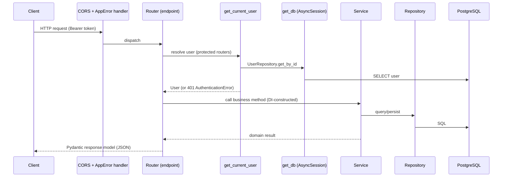
```mermaid
sequenceDiagram
  participant C as Client
  participant MW as CORS + AppError handler
  participant RT as Router (endpoint)
  participant AUTH as get_current_user
  participant DB as get_db (AsyncSession)
  participant SVC as Service
  participant REPO as Repository
  participant PG as PostgreSQL

  C->>MW: HTTP request (Bearer token)
  MW->>RT: dispatch
  RT->>AUTH: resolve user (protected routers)
  AUTH->>DB: UserRepository.get_by_id
  DB->>PG: SELECT user
  AUTH-->>RT: User (or 401 AuthenticationError)
  RT->>SVC: call business method (DI-constructed)
  SVC->>REPO: query/persist
  REPO->>PG: SQL
  SVC-->>RT: domain result
  RT-->>C: Pydantic response model (JSON)
```

### Dependency Injection
- **Request-scoped DB:** `get_db()` yields an `AsyncSession` from `AsyncSessionLocal`.
- **Service factories:** each router defines `get_*_service(db=Depends(get_db))` returning a
  service constructed with the session. Services accept optional collaborators in their
  constructors (constructor injection) with sensible defaults, enabling test substitution.
- **Process-wide singletons** (`@lru_cache`): `get_settings()`, `get_embedding_service()`,
  `get_ingestion_progress_service()`, `get_langfuse_service()`, `get_paddle_ocr_engine()`,
  `get_llm_provider()`.
- **Auth dependency:** `get_current_user` (in `api/deps.py`) validates the
  `Authorization: Bearer` header. Protected resource handlers pass only the resulting server-side
  `User.id` to services; the API never accepts an owner id from the browser. Foreign UUIDs resolve
  to the same `404` as missing resources to avoid resource-existence disclosure.

### Repository Pattern
All SQL lives in `repositories/`:

| Repository | Aggregate | Notable methods |
|---|---|---|
| `DocumentRepository` | documents | Owner-scoped `get_by_id`, `list_all`, `count`, `list_by_statuses`; `create`, `delete` |
| `DocumentChunkRepository` | document_chunks | `create_many`, `list_by_document_id`, `delete_by_document_id` |
| `EmbeddingRepository` | chunk_embeddings | `bulk_insert`, `delete_by_document_id`, `count_by_document_id` |
| `RetrievalRepository` | pgvector search | `search_similar(..., user_id, document_id)` and full-document loading, both joined to the owner document |
| `ConversationRepository` | conversations/messages | Owner-scoped CRUD + history |
| `DocumentAnalysisRepository` | persisted analyses | Get-or-compute persistence plus owner-scoped batch payload lookup for document scores |
| `UserRepository` | users | `create`, `get_by_email`, `get_by_id` |
| `VectorRepository` | (helper) | vector-related helpers |

### Services / Routers / Models / Schemas / Config / Middleware / Utilities
- **Services** (`app/services/`): `DocumentService`, `DocumentProcessingService`,
  `IndexingService`, `EmbeddingService`, `RetrievalService`, `RerankerService`,
  `GeneratorService`, deterministic `calculate_risk_score`, `ConversationService`, `AuthService`,
  `IngestionProgressService`,
  `LangfuseService`, plus helpers (`chunker`, `text_cleaner`, `prompt_builder`,
  `context_formatter`) and `llm/` provider abstraction.
- **Routers** (`app/api/v1/endpoints/`): thin — parse request, call one service, return a schema.
- **Models** (`app/models/`): ORM only (see §4).
- **Schemas** (`app/schemas/`): Pydantic v2 DTOs (`from_attributes=True` where mapping ORM).
- **Configuration:** `Settings` (pydantic-settings) loads env/`.env`; exposes computed
  `database_url` (asyncpg) and `database_url_sync` (psycopg2 for Alembic). Completion budgets are
  intentionally separate: `LLM_MAX_TOKENS` for concise chat, `AGENT_MAX_TOKENS` (8192) for detailed
  specialist analyses, and `DOCUMENT_MAX_TOKENS` (16000 plus continuation rounds) for reports.
- **Middleware:** only `CORSMiddleware` (open in development) + a global `AppError` exception
  handler. No custom auth middleware — auth is a router-level dependency.
- **Utilities:** `utils/storage.py` (`DocumentStorage` — async file save/delete, `is_pdf_content`
  magic-byte check).

---

## 4. Database

PostgreSQL 16 with the **`vector`** extension. Schema is managed by Alembic
(`versions/001`→`009`). Async access via `asyncpg`; Alembic uses sync `psycopg2`.

### Tables

**`users`** (migration 007) — application accounts.
| Column | Type | Notes |
|---|---|---|
| id | UUID | PK |
| email | VARCHAR(320) | **unique index** `ix_users_email` |
| hashed_password | VARCHAR(255) | PBKDF2 hash string |
| full_name | VARCHAR(255) | nullable |
| role | VARCHAR(50) | default `Juriste` |
| is_active | BOOLEAN | default `true` |
| created_at / updated_at | TIMESTAMPTZ | server default `now()` |

**`documents`** (001, extended by 002/003/005/009) — owner-bound uploaded PDF metadata + lifecycle.
| Column | Type | Notes |
|---|---|---|
| id | UUID | PK |
| user_id | UUID | FK→users `ON DELETE CASCADE`, first column of `ix_documents_user_id_upload_date` |
| original_filename | VARCHAR(255) | |
| stored_filename | VARCHAR(255) | **unique** |
| file_path | VARCHAR(512) | on-disk path |
| mime_type | VARCHAR(100) | always `application/pdf` |
| file_size | BIGINT | bytes |
| upload_date | TIMESTAMPTZ | `now()` |
| status | ENUM `document_status` | `uploaded/processing/processed/failed` (+ legacy `completed`) |
| extracted_text | TEXT | cleaned full text |
| page_count | INTEGER | nullable |
| extraction_method | ENUM `extraction_method` | `pdf_parser/paddle_ocr` |
| index_status | ENUM `index_status` | `not_indexed/indexing/indexed/failed` |
| indexed_at | TIMESTAMPTZ | nullable |
| indexed_chunk_count | INTEGER | nullable |
| embedding_model | VARCHAR(255) | nullable |

**`document_analyses`** (008) — latest persisted structured legal analysis for each contract.
| Column | Type | Notes |
|---|---|---|
| id | UUID | PK |
| document_id | UUID | FK→documents `ON DELETE CASCADE`, **unique indexed** |
| status | ENUM `analysis_status` | `processing/completed/failed` |
| payload | JSONB | complete `LegalAnalysisResponse`; nullable while processing/failed |
| analysis_version | VARCHAR(32) | currently `3`; invalidates results after prompt/schema/risk-score changes |
| request_fingerprint | VARCHAR(64) | SHA-256 of question and generation parameters |
| model | VARCHAR(255) | provider model used, nullable |
| error_message | TEXT | safe failure message, nullable |
| created_at / updated_at | TIMESTAMPTZ | server default `now()` |

`processing` rows prevent duplicate generation in the same API process. If the API restarts
mid-generation, `ContractAnalysisService` recognizes rows older than the current process and
reclaims them on the next request instead of leaving the contract permanently blocked.

**`document_chunks`** (004) — semantic chunks.
| Column | Type | Notes |
|---|---|---|
| id | UUID | PK |
| document_id | UUID | FK→documents `ON DELETE CASCADE`, **indexed** |
| chunk_index | INTEGER | |
| text | TEXT | |
| metadata (`metadata_`) | JSONB | default `{}` |
| created_at | TIMESTAMPTZ | |
| — | — | **UNIQUE(document_id, chunk_index)** |

**`chunk_embeddings`** (005) — vectors (denormalized for retrieval without joins).
| Column | Type | Notes |
|---|---|---|
| id | UUID | PK |
| document_id | UUID | FK→documents CASCADE, **indexed** `ix_chunk_embeddings_document_id` |
| chunk_id | UUID | FK→document_chunks CASCADE, **UNIQUE** `uq_chunk_embeddings_chunk_id` |
| filename | VARCHAR(255) | denormalized |
| page_numbers | JSONB | default `[]` |
| extraction_method | VARCHAR(50) | nullable |
| upload_date | TIMESTAMPTZ | |
| chunk_index | INTEGER | |
| chunk_text | TEXT | denormalized chunk text |
| embedding_model | VARCHAR(255) | |
| embedding | **VECTOR(1024)** | pgvector |
| created_at / updated_at | TIMESTAMPTZ | |
| — | — | **HNSW index** `ix_chunk_embeddings_embedding_hnsw USING hnsw (embedding vector_cosine_ops)` |

**`conversations`** (006, ownership added by 009) — chat sessions: `id`, `user_id`
(FK→users `ON DELETE CASCADE`, indexed with `updated_at`), `title`, `created_at`, `updated_at`.

**`messages`** (006) — `id`, `conversation_id` (FK→conversations CASCADE, **indexed**), `role`
ENUM `message_role` (`user/assistant`), `content` TEXT, `created_at`, `metadata` JSONB default
`{}`.

**`generated_documents`** (010) — persistent PDF reports exported from chat or analysis:
`id`, `user_id` (FK→users CASCADE), nullable `source_document_id` (FK→documents SET NULL),
`title`, original/stored filenames, file path/size/MIME type, `kind`, optional originating
question, and `created_at`. Owner/date and owner/source/date composite indexes support the global
library and per-contract report views. PDF bytes live under `storage/generated`.

**Enums:** `document_status`, `extraction_method`, `index_status`, `message_role`,
`analysis_status`, `generated_document_kind` (`chat_report`, `analysis_export`).

### ER Diagram
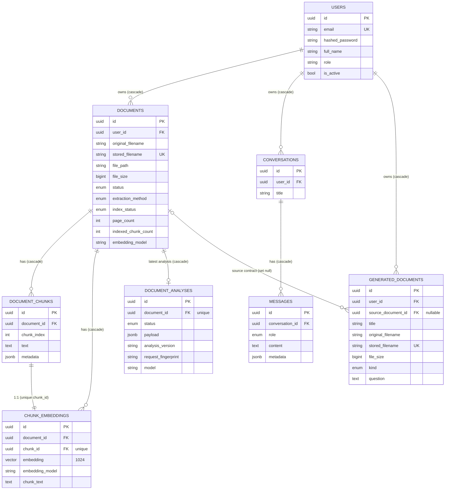
```mermaid
erDiagram
  USERS {
    uuid id PK
    string email UK
    string hashed_password
    string full_name
    string role
    bool is_active
  }
  DOCUMENTS {
    uuid id PK
    uuid user_id FK
    string original_filename
    string stored_filename UK
    string file_path
    bigint file_size
    enum status
    enum extraction_method
    enum index_status
    int page_count
    int indexed_chunk_count
    string embedding_model
  }
  DOCUMENT_ANALYSES {
    uuid id PK
    uuid document_id FK "unique"
    enum status
    jsonb payload
    string analysis_version
    string request_fingerprint
    string model
  }
  DOCUMENT_CHUNKS {
    uuid id PK
    uuid document_id FK
    int chunk_index
    text text
    jsonb metadata
  }
  CHUNK_EMBEDDINGS {
    uuid id PK
    uuid document_id FK
    uuid chunk_id FK "unique"
    vector embedding "1024"
    string embedding_model
    text chunk_text
  }
  CONVERSATIONS {
    uuid id PK
    uuid user_id FK
    string title
  }
  MESSAGES {
    uuid id PK
    uuid conversation_id FK
    enum role
    text content
    jsonb metadata
  }
  GENERATED_DOCUMENTS {
    uuid id PK
    uuid user_id FK
    uuid source_document_id FK "nullable"
    string title
    string original_filename
    string stored_filename UK
    bigint file_size
    enum kind
    text question
  }

  USERS ||--o{ DOCUMENTS : "owns (cascade)"
  USERS ||--o{ CONVERSATIONS : "owns (cascade)"
  USERS ||--o{ GENERATED_DOCUMENTS : "owns (cascade)"
  DOCUMENTS ||--o{ DOCUMENT_CHUNKS : "has (cascade)"
  DOCUMENTS ||--o{ CHUNK_EMBEDDINGS : "has (cascade)"
  DOCUMENTS ||--o| DOCUMENT_ANALYSES : "latest analysis (cascade)"
  DOCUMENT_CHUNKS ||--|| CHUNK_EMBEDDINGS : "1:1 (unique chunk_id)"
  CONVERSATIONS ||--o{ MESSAGES : "has (cascade)"
  DOCUMENTS o|--o{ GENERATED_DOCUMENTS : "source contract (set null)"
```

Migration 009 added both owner columns as nullable, assigned all legacy rows to the earliest account
(`users.created_at`, then UUID), and only then enforced `NOT NULL`, foreign keys, and owner-first
indexes. Child rows inherit isolation through their document/conversation parent.

### pgvector integration
- Extension enabled by migration 005 (`CREATE EXTENSION IF NOT EXISTS vector`).
- Column type `Vector(1024)` (`pgvector.sqlalchemy.Vector`), matching `EMBEDDING_DIMENSION`
  (bge-m3 / e5-large = 1024).
- **HNSW** cosine index for ANN search.
- Query (in `RetrievalRepository.search_similar`): `distance = embedding.cosine_distance(query_embedding)`,
  `similarity = 1 - distance`, `ORDER BY distance LIMIT top_k`, filtered to
  `Document.index_status == INDEXED` (optional `document_id` filter).

---

## 5. RAG Pipeline (stage by stage)

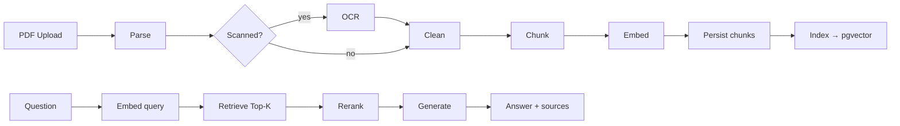
```mermaid
flowchart LR
  U[PDF Upload] --> P[Parse] --> O{Scanned?}
  O -- yes --> OCR[OCR] --> CL[Clean]
  O -- no --> CL
  CL --> CH[Chunk] --> EM[Embed] --> PS[Persist chunks] --> IX[Index → pgvector]
  Q[Question] --> QE[Embed query] --> RT[Retrieve Top-K] --> RR[Rerank] --> GEN[Generate] --> ANS[Answer + sources]
```

| Stage | Input | Output | Class / Service | Repository | DB interaction |
|---|---|---|---|---|---|
| **Upload** | `UploadFile` + authenticated user | Owner-bound `Document` row + stored file + `task_id` | `DocumentService.upload` | `DocumentRepository` | INSERT `documents(user_id, …)` (status `uploaded`); file → `storage/documents` |
| **Parse** | `file_path` | text + page_count + `pdf_parser` method | `ParserNode` → `PdfParser` (PyMuPDF `fitz`) | — | none |
| **OCR** (conditional) | `file_path` | text + `paddle_ocr` method | `OCRNode` → `run_paddle_ocr_subprocess` / `PaddleOcrEngine` | — | none (isolated subprocess) |
| **Clean** | raw text/pages | normalized text | `CleaningNode` → `text_cleaner.clean_text/clean_pages` | — | none |
| **Chunk** | cleaned text | `ChunkDraft[]` (size 900 / overlap 175) | `ChunkingNode` → `SemanticChunker` | — | none (in-memory) |
| **Persist** | chunk drafts | `document_chunks` rows; status `processed` | graph `persist_step` → `DocumentProcessingService.finalize_chunks` | `DocumentChunkRepository.create_many` | INSERT chunks; UPDATE document |
| **Embed** | chunk texts | `list[vector]` | `EmbeddingNode` → `EmbeddingService.embed_batch` (FastEmbed bge-m3) | — | none |
| **Index** | chunks (+ reused vectors) | `chunk_embeddings` rows; `index_status=indexed` | `IndexingNode` → `IndexingService.index_document` | `EmbeddingRepository.bulk_insert` | DELETE old + INSERT vectors; UPDATE document |
| **Retrieve** | query text + authenticated `user_id` | Top-K `RetrievalHit[]` from only that user's contracts | `RetrievalService.retrieve_hits` → `EmbeddingService.embed_query` | `RetrievalRepository.search_similar` | pgvector cosine SELECT joined to `documents.user_id` |
| **Rerank** | query + hits | `RerankedHit[]` (final_k) | `RerankerService.rerank_hits` (CrossEncoder bge-reranker-v2-m3) | — | none |
| **Generate** | question + reranked chunks | grounded answer + sources + metadata | `GeneratorService.generate_from_chunks` → `PromptBuilder` + LLM provider | — | none (HTTP to LLM) |
| **Response** | answer | JSON / SSE stream | endpoint (`/chat/*`) | — | conversation path writes `messages` |

Performance note: `IndexingService.index_document` accepts `precomputed_embeddings` so the
ingestion graph reuses `EmbeddingNode` vectors instead of re-embedding (identical result, one
fewer embedding pass).

Security invariant: both Top-K mode and full-document mode require a server-derived `user_id`.
`RetrievalRepository` joins `documents` and filters `documents.user_id`, including when no
`document_id` is selected ("all my contracts"). A supplied foreign document UUID therefore
produces no chunks and cannot cross tenant boundaries.

---

## 6. Current LangGraph Integration

**Two distinct abstractions coexist (do not conflate them):**

| Layer | Base class | State object | Where used |
|---|---|---|---|
| LangGraph nodes | `agents/base_agent.py` `BaseGraphAgent` | `state/graph_state.py` `GraphState` | ingestion + rag + **multi-agent** graphs |
| Legacy agent interface | `agents/base.py` `BaseAgent` | `AgentContext` / `AgentResult` | `LegalAgent` only (`/agents/legal/analyze`) |

- **`BaseGraphAgent`** — abstract: `name`, `description`, `async execute(state) -> GraphState`.
  All 14 nodes implement it (9 ingestion/RAG + 5 multi-agent).
- **`GraphState`** (`TypedDict, total=False`): the ingestion/RAG fields (`document_id, filename,
  extracted_text, cleaned_text, chunks, embeddings, retrieved_chunks, reranked_chunks,
  user_question, llm_response`) **plus** the multi-agent fields (`user_query, target_agent,
  legal_result, finance_result, compliance_result, final_recommendation`) and the cross-cutting
  `metadata, errors`. Request graphs carry the authenticated owner id in `metadata.user_id`;
  retrieval/generator nodes require it and propagate it to owner-scoped services.
- **`GraphBuilder`** (`graphs/graph_builder.py`) — ✗ **placeholder**:
  `add_node/add_edge/set_entry_point` fluent stubs; `build()` raises `NotImplementedError`;
  **zero runtime callers**. Real graphs use LangGraph's native `StateGraph` directly — the name
  is misleading.

**Nodes** (`agents/nodes/`, all thin wrappers over services): `ParserNode, OCRNode, CleaningNode,
ChunkingNode, EmbeddingNode, IndexingNode` (ingestion), `RetrievalNode, RerankerNode,
GeneratorNode` (RAG) and `CommandParserNode, LegalNode, FinanceNode, ComplianceNode, SynthesisNode`
(multi-agent; shared skeleton in `_agent_node.py`, specialized prompts in `agent_prompts.py`).
Shared state helpers in `_state_utils.py`.

**Current graphs**

| Graph | Builder | Topology | Wired to | Status |
|---|---|---|---|---|
| Ingestion | `build_ingestion_graph` | `parser → {ocr\|cleaning} → cleaning → chunking → embedding → persist → {indexing\|END}` | `DocumentProcessingService.process_document` (via Celery) | ✓ **Production** |
| RAG | `build_rag_graph` | `embedding → retrieval → reranker → generator → END` | **only** `POST /chat/query` | ⚠ Partially used |
| Multi-agent | `build_multi_agent_graph` | `command_parser → {legal\|finance\|compliance → END}` (single) or `legal → finance → compliance → synthesis → END` (default) | `POST /agents/query` (Consultation slash commands) | ✓ **Production** |

- All three graphs share a **transient-only** retry policy (`app/graphs/retry.py::transient_retry_policy`,
  3 attempts). It retries only recoverable failures (timeouts, 429, 5xx, `AppError.retryable`,
  network blips) and fails fast on permanent errors (validation, not-found, auth/config) so retries
  are never wasted. Falls back to attempt-count-only on older LangGraph versions.
- Ingestion graph applies the shared policy on parse/ocr/embedding/persist/indexing; conditional
  routing via `ExtractionPipeline.is_scanned_pdf`; `PdfParseError` → OCR fallback; `IndexingError`
  tolerated (document stays *processed*); optional `on_stage` callback publishes progress to Redis.
- RAG graph's `EmbeddingNode` is a structural no-op for queries (query embedding happens inside
  `RetrievalService`).
- **Multi-agent graph** — `CommandParserNode` reads a leading `/legal|/finance|/compliance` command
  (case-insensitive) into `target_agent`. Conditional edges (`route_after_command`,
  `route_after_{legal,finance,compliance}`) route a targeted command straight to that one agent node
  → `END`, or, with no command, chain the three agent nodes **sequentially** into `SynthesisNode`.
  The chain is sequential (not a parallel fan-out) **by design**: a request carries a single
  `AsyncSession` and SQLAlchemy sessions are not concurrency-safe, and each agent hits the DB via
  retrieval. Agent nodes degrade gracefully (a failed agent records an error result instead of
  killing the run); the shared retry policy still covers transient failures. `LegalNode`/`FinanceNode`/
  `ComplianceNode` share one injected `GeneratorService` (reusing the RAG pipeline with a specialized
  system prompt each); `SynthesisNode` reuses the existing LLM provider to cross-reference the three
  analyses into `final_recommendation` (it never re-runs retrieval and adds no new facts).
- **Selected-agent scope guard:** when `target_agent` is set by an explicit slash command,
  `DomainGuardService` checks the command-stripped question against multilingual legal, finance and
  compliance signals before retrieval. An out-of-domain request returns `status=out_of_scope`, a
  human-readable redirection to the appropriate slash command, and no database retrieval or LLM
  call. Default `/synthese` execution intentionally skips this guard so all three perspectives run.
- **Observability bridge:** `LangfuseService.trace_node()` wraps every node in all three graphs
  (no-op unless `LANGFUSE_ENABLED`).

**How LangGraph integrates with services:** nodes hold injected services and delegate; graphs are
built per-request/per-task from the `AsyncSession`. **No business logic lives in nodes/graphs.**

⚠ **Not integrated:** the primary chat UI uses `/chat/stream` which bypasses the RAG graph entirely
(calls `GeneratorService.stream_answer` directly). The multi-agent graph powers the blocking
`POST /agents/query`. The Consultation page invokes agents via **slash commands** (`/legal`,
`/finance`, `/compliance`, and a `/synthese` menu entry) but over the **streaming** endpoint
`POST /agents/stream` (`AgentStreamService`) so agent answers are fragmented like the normal chat —
single-agent commands stream `GeneratorService.stream_answer` with the specialized prompt, and
`/synthese` runs the three agents then streams the synthesis. `/agents/query` remains the blocking
JSON equivalent. Plain messages (no slash) still use `/chat/stream`.

---

## 7. AI Components

| Component | Implementation | Interaction |
|---|---|---|
| **Embedding model** | `EmbeddingService` — FastEmbed ONNX `BAAI/bge-m3` (fallback `intfloat/multilingual-e5-large`), dim 1024, process singleton, `embed_query` adds `query:` prefix for E5 | Used by ingestion (`embed_batch`) and retrieval (`embed_query`) |
| **Retriever** | `RetrievalService` + `RetrievalRepository` (pgvector cosine Top-K, `INDEXED` only) | Consumes query embedding → hits |
| **Reranker** | `RerankerService` — FastEmbed CrossEncoder `BAAI/bge-reranker-v2-m3` (fallback MiniLM), runs in `asyncio.to_thread` | Reorders retrieval hits, keeps `final_k` |
| **Generator** | `GeneratorService` — retrieve→rerank→`PromptBuilder`→LLM; `answer_question`, `generate_from_chunks`, `stream_answer` (SSE). `stream_answer` **guarantees a non-empty answer**: if the stream emits no fragments it falls back to a blocking `complete()`, then to the grounded no-answer message, and always includes the final `answer` in the `done` event | Central RAG engine; reused by chat, conversations, agents |
| **LLM provider layer** | `BaseLLMProvider` (shared OpenAI-compatible HTTP + bounded exponential-backoff retries on transient errors + granular httpx timeout connect 15s/read 300s + SSE parsing + professional error mapping). Concrete subclasses `OpenAIProvider`, `GroqProvider`, `NvidiaProvider`, `OpenRouterProvider` (in `services/llm/providers.py`) only set defaults/headers. `OpenAICompatibleProvider` retained as a thin alias for backward compatibility | HTTP `/chat/completions` |
| **Provider factory** | `get_llm_provider` — env-driven registry (`services/llm/factory.py`). `LLM_PROVIDER` selects the provider; the API key resolves from a provider-specific env var (`OPENAI_API_KEY`/`GROQ_API_KEY`/`NVIDIA_API_KEY`/`OPENROUTER_API_KEY`) then falls back to generic `LLM_API_KEY`. Adding a provider = one registry entry | — |
| **Conversation memory** | `ConversationService` — persists messages; `load_history` (limit `CONVERSATION_HISTORY_LIMIT=10`) injected into prompt (history loaded *before* current turn) | Feeds `GeneratorService.answer_question(history=...)` |
| **Multi-Agent graph** | `build_multi_agent_graph` (LangGraph `StateGraph`) — `CommandParserNode` routes a `/legal\|/finance\|/compliance` command to a single agent node, else chains `LegalNode → FinanceNode → ComplianceNode → SynthesisNode`. Real graph nodes + conditional edges (no external Python dispatch) | Blocking `POST /agents/query` |
| **Multi-Agent streaming** | `AgentStreamService` (`services/agent_stream.py`) — SSE counterpart used by the Consultation slash commands. A selected agent first passes `DomainGuardService`; out-of-scope requests stream a refusal without retrieval/LLM. Accepted single agents reuse `stream_answer`; `/synthese` runs three `answer_question` calls then a streamed synthesis. Every accepted specialist/synthesis uses `AGENT_MAX_TOKENS` (8192 by default), independently of the shorter chat budget. | `POST /agents/stream` — Consultation **slash commands** (fragmented) |
| **Legal/Finance/Compliance nodes** | `LegalNode`/`FinanceNode`/`ComplianceNode` (`agents/nodes/`, share `DomainAgentNode`) — each enforces the selected-agent domain boundary, then reuses the injected `GeneratorService` RAG pipeline with its specialized system prompt; writes `{legal,finance,compliance}_result` on the state | Multi-agent graph nodes |
| **Domain guard** | `DomainGuardService` wraps the multilingual deterministic detector in `agents/intent.py`; returns detected domains/keywords and a safe business message. It classifies scope only and does not perform graph routing. | Blocking graph nodes + streaming single-agent path |
| **SynthesisNode** | `agents/nodes/synthesis_node.py` — reads the three result fields and calls the LLM provider with `SYNTHESIS_SYSTEM_PROMPT` to weigh/cross-reference them into `final_recommendation` (no retrieval, no new facts) | Multi-agent graph fan-in |
| **LegalAgent** | `LegalAgent.analyze` — `GeneratorService.analyze_contract` (structured JSON: summary/risk/critical points/missing info/recommendations, full-document grounded) with `RuleBasedRiskClassifier` fallback. `calculate_risk_score` deterministically converts all deduplicated findings into a cumulative 0–100 score. `ContractAnalysisService` wraps it with get-or-compute persistence in `document_analyses`; cache identity uses document + analysis version + request fingerprint | `POST /agents/legal/analyze` (used by Analysis page) |

**Risk score formula (`services/risk_score.py`):** exact duplicate findings are counted once. The
highest severity selects a non-overlapping band, then every additional finding and missing item
reduces the score inside that band: high starts at 45 and loses 4 per additional high, medium
starts at 78 and floors at 50, low starts at 95 and floors at 80, and a finding-free complete
contract scores 100. Secondary findings use smaller weights and missing-information penalties are
capped, preventing overlapping descriptions from collapsing a balanced contract to zero. Sixteen
distinct high findings still score 0. The displayed `risk_level` is derived from the highest
finding, correcting contradictory model output such as “medium” alongside high-severity findings.

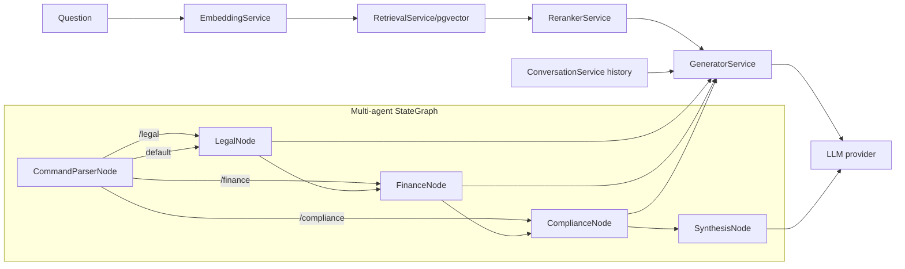
```mermaid
flowchart LR
  Q[Question] --> EMB[EmbeddingService]
  EMB --> RET[RetrievalService/pgvector]
  RET --> RRK[RerankerService]
  RRK --> GEN[GeneratorService]
  GEN --> LLMP[LLM provider]
  CONV[ConversationService history] --> GEN
  subgraph MA[Multi-agent StateGraph]
    CP[CommandParserNode] -->|/legal| LEG[LegalNode]
    CP -->|/finance| FIN[FinanceNode]
    CP -->|/compliance| COM[ComplianceNode]
    CP -->|default| LEG --> FIN --> COM --> SYN[SynthesisNode]
  end
  LEG --> GEN
  FIN --> GEN
  COM --> GEN
  SYN --> LLMP
```

---

## 8. API Documentation

Base prefix: `/api/v1`. All `documents`, `retrieval`, `chat`, `agents` routers require
`Authorization: Bearer <JWT>`. Every document/conversation operation and every retrieval path is
scoped by the `User.id` decoded from that JWT. Client payloads contain no `user_id`; access to a
foreign UUID returns `404`.

### Auth (public)
| Method / URL | Request | Response | Service | DB |
|---|---|---|---|---|
| POST `/auth/register` | `{email, password, full_name?, role?}` | `201 {access_token, token_type, user}` | `AuthService.register` | INSERT `users` |
| POST `/auth/login` | `{email, password}` | `{access_token, token_type, user}` | `AuthService.authenticate` | SELECT `users` |
| GET `/auth/me` | — (Bearer) | `UserResponse` | `get_current_user` | SELECT `users` |

### Health (public)
| Method / URL | Request | Response | Service | DB |
|---|---|---|---|---|
| GET `/health` | — | `{status, app_name, version, environment, timestamp, database}` | inline | `SELECT 1` |

### Documents (protected)
| Method / URL | Request | Response | Service | DB |
|---|---|---|---|---|
| POST `/documents` | multipart `file` | `202 DocumentUploadResponse {document_id, task_id, status, filename, message}` | `DocumentService.upload` → Celery enqueue | INSERT `documents`; Redis queued |
| GET `/documents` | `skip,limit` | `DocumentListResponse` (`analysis_score` is populated from an existing stored analysis, otherwise `null`) | `DocumentService.list_documents` | owner-filtered documents + completed-analysis payloads + COUNT |
| GET `/documents/{id}` | — | `DocumentResponse` | `DocumentService.get_document` | SELECT |
| DELETE `/documents/{id}` | — | `204` | `DocumentService.delete_document` | DELETE (+ file) |
| GET `/documents/{id}/chunks` | — | `DocumentChunkListResponse` | `DocumentProcessingService.get_chunks` | SELECT chunks |
| GET `/documents/{id}/status` | — | `DocumentStatusResponse` | `DocumentProcessingService.get_status` | SELECT |
| GET `/documents/{id}/progress` | — | `DocumentProgressResponse` (stage, %, timeline, error) | `DocumentService.get_progress` | Redis (fallback DB) |
| POST `/documents/{id}/reprocess` | — | `202 DocumentUploadResponse` | `DocumentService.reprocess` | Celery enqueue |
| POST `/documents/{id}/index` | — | `DocumentIndexResponse` | `IndexingService.index_document` | INSERT vectors |
| DELETE `/documents/{id}/index` | — | `DocumentIndexResponse` | `IndexingService.delete_index` | DELETE vectors |
| GET `/documents/{id}/index-status` | — | `DocumentIndexStatusResponse` | `IndexingService.get_index_status` | SELECT/COUNT |
| POST `/documents/reindex` | — | `DocumentReindexResponse` | `IndexingService.reindex_all` | bulk re-index of current user's documents |

### Retrieval (protected)
| Method / URL | Request | Response | Service | DB |
|---|---|---|---|---|
| POST `/retrieve` | `{query, top_k?}` | `RetrieveResponse{query, top_k, results[]}` | `RetrievalService.retrieve` | owner-filtered pgvector SELECT |
| POST `/retrieve/rerank` | `{query, top_k?, final_k?}` | `RerankResponse{..., reranker_model, results[]}` | `RerankerService.retrieve_and_rerank` | pgvector SELECT |

### Chat (protected)
| Method / URL | Request | Response | Service | DB |
|---|---|---|---|---|
| POST `/chat/query` | `ChatQueryRequest{question, document_id?, top_k?, final_k?, temperature?, max_tokens?}` | `ChatQueryResponse{answer, sources[], metadata}` | `build_rag_graph` → nodes | pgvector SELECT; LLM |
| POST `/chat/stream` | `ChatQueryRequest` | **SSE** events `data:{type:sources\|delta\|done\|error}` | `GeneratorService.stream_answer` | pgvector SELECT; LLM stream |
| POST `/chat/jobs` | `ChatJobCreateRequest{mode:"chat"\|"agent", question, document_id?, ...}` | `202 {job_id,status:"queued"}` | Redis `ChatJobStore` → Celery `chat.generate` | Redis; worker later uses pgvector/LLM |
| GET `/chat/jobs/{job_id}` | — | `{job_id,mode,status,event_count}` | owner-checked `ChatJobStore` | Redis |
| GET `/chat/jobs/{job_id}/stream?after=N` | — | replayable **SSE** event stream until terminal status | owner-checked `ChatJobStore` | Redis event list |
| POST `/chat/document` | `ChatQueryRequest` | `ChatDocumentResponse{html, generated_document_id, sources[], metadata}` — the PDF is rendered and persisted before this response, without waiting for a download click | `GeneratorService.generate_document` → `render_html_to_pdf` → `GeneratedDocumentService.save_pdf` | pgvector SELECT; LLM; INSERT `generated_documents`; file → `storage/generated` |
| POST `/chat/document/pdf` | `{html, filename?, title?, source_document_id?, kind?, question?}` | PDF attachment + `X-Generated-Document-Id`; every rendered PDF is persisted before download | `render_html_to_pdf` → `GeneratedDocumentService.save_pdf` | INSERT `generated_documents`; file → `storage/generated` |
| POST `/chat/conversations` | `{title?}` | `201 ConversationResponse` | `ConversationService.create_conversation` | INSERT |
| GET `/chat/conversations` | `skip,limit` | `ConversationListResponse` | `list_conversations` | SELECT |
| GET `/chat/conversations/{id}` | — | `ConversationResponse` (+messages) | `get_conversation` | SELECT |
| DELETE `/chat/conversations/{id}` | — | `204` | `delete_conversation` | DELETE cascade |
| POST `/chat/conversations/{id}/messages` | `ConversationMessageRequest{content, top_k?, ...}` | `ConversationMessageResponse{user_message, assistant_message, answer, sources, metadata}` | `ConversationService.send_user_message` → `GeneratorService.answer_question` | INSERT messages; pgvector; LLM |

### Agents (protected)
| Method / URL | Request | Response | Service | DB |
|---|---|---|---|---|
| POST `/agents/query` | `AgentQueryRequest{question, document_id?, top_k?, final_k?, temperature?, max_tokens?}` | `AgentQueryResponse` — either `{mode:"single", agent, response}` (including `status:"out_of_scope"` when the question does not match the selected specialist) or `{mode:"multi", recommendation, legal, finance, compliance}` | `DomainGuardService` → `build_multi_agent_graph` nodes | pgvector/LLM only when accepted |
| POST `/agents/stream` | same `AgentQueryRequest` | **SSE** stream — accepted single agent: `agent`+`sources`+`delta`*+`done`; out-of-scope: `agent`+refusal `delta`+`done`; multi: `status`*+`analyses`+`delta`*+`done` | `DomainGuardService` → `AgentStreamService` | pgvector/LLM only when accepted |
| POST `/agents/legal/analyze` | `LegalAnalyzeRequest{question, document_id?, conversation_id?, force_refresh=false, ...}` | `LegalAnalysisResponse{analysis, risk_level, risk_score, missing_information[], sources[], recommendations[], metadata}`; scoped calls return a matching stored result immediately, otherwise calculate and persist it | `ContractAnalysisService.get_or_analyze` → `LegalAgent.analyze` → deterministic score on cache miss | SELECT/UPSERT `document_analyses`; pgvector + LLM only on miss/refresh |
| POST `/agents/legal/analyze/jobs` | `LegalAnalysisJobRequest` (owned `document_id` required) | `202 {job_id,document_id,status:"queued"}` | Redis `AnalysisJobStore` → Celery `analysis.generate` | Redis + background DB/LLM work |
| GET `/agents/legal/analyze/jobs/{job_id}` | — | owner-scoped `{status,progress,message,result?,error?}` | `AnalysisJobStore.get_for_user` | Redis |

### Generated documents (protected)
| Method / URL | Request | Response | Service | Storage |
|---|---|---|---|---|
| GET `/generated-documents` | `source_document_id?, skip, limit` | owner-scoped `GeneratedDocumentListResponse` | `GeneratedDocumentService.list_documents` | SELECT `generated_documents` |
| GET `/generated-documents/{id}/file` | `download?` | inline/attachment PDF | `GeneratedDocumentService.get_document` | DB ownership check + `storage/generated` |
| DELETE `/generated-documents/{id}` | — | `204` | `GeneratedDocumentService.delete_document` | DELETE row + PDF file |

**Typical flow example (`/chat/stream`):** endpoint → `GeneratorService.stream_answer` →
`_retrieve_and_rerank` (embed → pgvector → CrossEncoder) → `_prepare_prompt` → yields `sources`,
then LLM `stream_complete` deltas, then `done` (includes the full `answer` as a fallback).

**Document scoping (all chat endpoints):** `ChatQueryRequest` accepts an optional `document_id`.
When set, retrieval is filtered to that single owned document (`RetrievalService.search_similar(...,
user_id=..., document_id=...)`); when omitted/null, answers are grounded on the authenticated
user's **entire** library (default), never the global database.
`/chat/query` propagates it via `GraphState.document_id` (read by `RetrievalNode`); `/chat/stream`
and `/chat/document` pass it straight to `GeneratorService`; `/chat/jobs` serializes it into the
Celery payload. The Consultation UI exposes this as a
scope selector ("Tous les documents" vs a specific indexed document) shown in the chat header.

**Multi-document coverage (all-documents mode):** plain Top-K concentrates on whichever document has
the most matching chunks, so library-wide questions used to answer from a single file. In
`GeneratorService._retrieve_and_rerank`, when `document_id is None`, the candidate pool is widened
(`multi_doc_candidate_k`, default 40, capped at the SQL limit of 50), the whole pool is reranked, then
`_diversify_by_document` caps how many chunks any single document contributes
(`multi_doc_per_document_cap`, default 2) before keeping `multi_doc_final_k` (default 8) chunks —
back-filling remaining slots with the best leftovers. Single-document and graph (`/chat/query`) paths
are unchanged. Settings live in `core/config.py`.

**Duplicate cleanup:** `python -m app.scripts.dedupe_documents` (dry-run; `--apply` to delete) removes
documents sharing the same `original_filename` + `file_size` (no content-hash column exists), keeping
one canonical copy (INDEXED first, then earliest upload). Deletion cascades to chunks/embeddings and
removes the stored PDF. Duplicate uploads otherwise skew retrieval toward the duplicated files.

**Document generation mode (`/chat/document`):** same grounded retrieve → rerank pipeline as the
chat, but `GeneratorService.generate_document` swaps in `DOCUMENT_SYSTEM_INSTRUCTIONS` (asks the
model for a full, self-contained HTML5 document with inline CSS) and a larger completion budget
(`max(LLM_MAX_TOKENS, DOCUMENT_MAX_TOKENS)`, currently 16000). Output is normalised by `_extract_html` (strips markdown fences,
wraps prose when needed). The frontend detects document intent client-side (`wantsDocument` in
`services/chat.ts`), renders the HTML in a sandboxed `<iframe>`, and offers **Print → PDF**
(`window.print`) and **Download `.html`** — no server-side PDF dependency. Default model for rich
output is `anthropic/claude-sonnet-4.5` via OpenRouter (env-driven, `LLM_MODEL`).

### Error handling & response envelope (enterprise UX)
All errors are normalized by global handlers in `app/main.py` so clients get a consistent,
professional, non-technical payload and **never** a stack trace or internal detail:

```json
{ "detail": "<human-readable message>", "code": "<machine_code>", "retryable": true }
```

- `AppError` (and subclasses) → their own status + professional `message`; technical `detail` is
  logged only. `LLMProviderError` maps HTTP 429/5xx/timeouts/malformed responses to friendly
  French messages and a `retryable` flag.
- `RequestValidationError` → `422` with a clean field message (no raw pydantic dump).
- Any unhandled `Exception` → `500` generic message (`code: internal_error`), full traceback
  logged server-side only.
- `/chat/stream` emits errors as an SSE `error` event carrying `message`/`code`/`retryable`
  (never leaking internals).

---

## 9. Frontend Architecture

- **Stack:** React 18 + TypeScript + Vite, Tailwind CSS v4, React Router, TanStack React Query,
  Axios, react-hook-form, lucide-react, Recharts.
- **Bootstrap (`main.tsx`):** `QueryClientProvider` (staleTime 30s, retry 1, no refetch-on-focus)
  → `AuthProvider` → `App`.
- **Routing (`App.tsx`):** `BrowserRouter`. Public: `/login` (and `/`→`/login`). Protected under
  `<RequireAuth>`: `/dashboard`, `/consultation`, `/documents`, `/analysis/:id`, `/history`,
  `/settings`; catch-all → `/dashboard`. ✗ `Supervision.tsx` and `AgentDetail.tsx` **exist but
  are not imported/routed** (dead pages).
- **Auth (`context/AuthContext.tsx`, `RequireAuth`):** token in `localStorage`
  (`legallink_token`); on mount, hydrates via `GET /auth/me`; `login/register/logout`;
  `RequireAuth` shows a spinner during hydration then redirects unauthenticated users to `/login`.
  Successful login/register and logout clear the React Query cache before the account state changes,
  preventing stale server data from the previous account from flashing in the UI.
- **API client (`services/api.ts`):** axios `baseURL = VITE_API_BASE_URL ?? '/api/v1'`, timeout
  **600s**; request interceptor injects Bearer token; response interceptor on **401** clears token
  and hard-redirects to `/login` (except `/auth/*`).
- **Services:** `auth.ts` (`/auth/*`), `documents.ts` (`/documents*`), `chat.ts` (`askQuestion`
  ⚠ unused, `streamQuestion` SSE via `fetch`), `analysis.ts` (`/agents/legal/analyze`, including
  explicit `force_refresh`).
- **Hooks (`useDocuments.ts`):** `useDocuments`, `useRecentActivity`, `useLegalAnalysis(id)`
  (backend-persisted get-or-compute result), `useRefreshLegalAnalysis(id)` (explicit recompute),
  `useUploadDocument`, `useDocumentProgress(id)` (polls every 1.5s until terminal). The legal
  analysis query key includes the score-version number so a scoring revision cannot reuse stale
  browser data.
- **Durable Analysis page:** `useLegalAnalysis` starts `analysis.generate` through the job API,
  stores its job id under an account/document-scoped localStorage key, and polls Redis. Navigation
  or refresh aborts only the browser poll, never the Celery task; reopening the same contract
  resumes that job and receives its stored structured result. Explicit refresh replaces the job id.
- **State management:** React Query for server state (keys `['documents']`, `['activity']`,
  `['legal-analysis', id]`, `['document-progress', id]`); local `useState` per page; no
  Redux/Zustand. Consultation history is persisted per account under
  `legallink.conversations.v2.<user-id>`; no account reads the former global key or another
  account's local history. Assistant placeholders retain the Redis `backgroundJobId`; reopening a
  conversation replays stored fragments and follows the same job until completion.
- **Pages:** Dashboard/Documents/GeneratedDocuments/History/Analysis/Settings/Login/Consultation are **wired to the
  backend**; `mock.ts` is largely unused (only chat `suggestions`); some chart components and the
  History period filter are cosmetic.
- **Generated PDF library:** `/generated-documents` lists every owner-scoped PDF exported from a
  consultation or analysis, with view/download/delete actions. `?contractId=<uuid>` filters the
  library to one source contract; each row in “Mes contrats” links directly to that filtered view.
  Chat document generation saves its PDF immediately; “Télécharger PDF” retrieves that existing
  file and does not create a duplicate. The page provides accent-insensitive client-side search
  across source contract filename, report title/filename, originating request, report type and
  generation date (ISO, numeric French date or written French date).
- **Canonical report presentation:** `services/pdf.py::brand_report_html` wraps every report before
  preview/rendering with the LegalLink header, the same transparent logo used by the SPA, the
  burgundy visual identity, standardized typography/headings/tables, A4 margins, confidentiality
  footer and page numbering. `render_html_to_pdf` applies this shell centrally, so analysis exports
  and future PDF-producing features inherit it automatically. Docker mounts the read-only site logo
  at `BRAND_LOGO_PATH=/brand/logo.png`; only inline `data:` resources reach WeasyPrint.
- **Generation intent:** in Consultation, any direct conjugation of “générer” (`génère`,
  `générer`, `générez`, with or without accents) is recognized as a document request.
- **Explicit consultation mode:** the composer exposes a segmented **Conversation / Génération
  PDF** control. Conversation mode always uses chat/agents and refuses file-generation wording with
  a human-readable instruction to switch modes; it never creates a PDF implicitly. Génération PDF
  mode sends every request through `/chat/document`, regardless of wording, then automatically
  persists the branded PDF. Slash-agent selection is available only in Conversation mode.
- **Business-language output:** shared chat/document prompts and every specialist/synthesis prompt
  explicitly prohibit exposing implementation vocabulary (`chunk`, RAG, embeddings, vectors,
  retrieval/reranking, prompts, tokens, context windows, model/provider/API/pipeline/database).
  User-visible answers and reports use legal wording such as “passage du contrat”, “document
  source” and “recherche dans les documents”.
- **History scores:** each row consumes `DocumentResponse.analysis_score`, obtained in one
  owner-scoped batch lookup from `document_analyses`. Numeric `risk_score` is the deterministic
  backend result used consistently by History, Analysis, the gauge and PDF.
  Contracts without a persisted analysis display “Non analysé” and do not trigger costly analysis
  generation merely by opening History.
- **Analysis page:** opening `/analysis/:id` returns the stored per-document analysis when valid;
  the first visit computes and persists it. The header shows the saved timestamp and exposes
  **Relancer l’analyse** to force a replacement. **Exporter en PDF** builds a deterministic,
  styled report from the stored structured result (summary, score, findings, missing information,
  recommendations, sources) and reuses `POST /chat/document/pdf` / WeasyPrint for the download.
  A **Documents générés** tab lists only PDFs associated with this contract and provides direct
  preview/download actions; a newly exported analysis invalidates that list immediately. The
  **Points critiques** tab provides severity filters (all/high/medium/low) with live counts.
- **Communication with FastAPI:** REST via axios; SSE via `fetch` + `ReadableStream` for streaming
  chat; dev requests proxied `/api` → `http://localhost:8000`.

---

## 10. Sequence Diagrams

**Uploading a document**
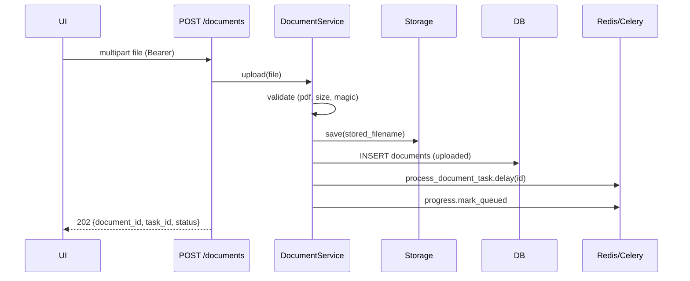
```mermaid
sequenceDiagram
  participant UI
  participant API as POST /documents
  participant DS as DocumentService
  participant FS as Storage
  participant DB
  participant RQ as Redis/Celery
  UI->>API: multipart file (Bearer)
  API->>DS: upload(file)
  DS->>DS: validate (pdf, size, magic)
  DS->>FS: save(stored_filename)
  DS->>DB: INSERT documents (uploaded)
  DS->>RQ: process_document_task.delay(id)
  DS->>RQ: progress.mark_queued
  API-->>UI: 202 {document_id, task_id, status}
```

**Document indexing (background ingestion)**
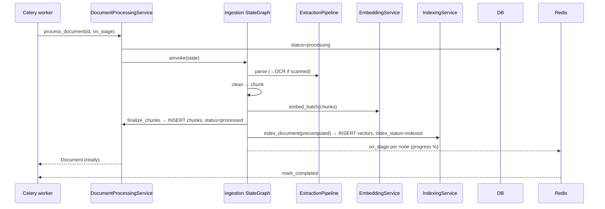
```mermaid
sequenceDiagram
  participant W as Celery worker
  participant DPS as DocumentProcessingService
  participant G as ingestion StateGraph
  participant EX as ExtractionPipeline
  participant EMB as EmbeddingService
  participant IX as IndexingService
  participant DB
  participant RED as Redis
  W->>DPS: process_document(id, on_stage)
  DPS->>DB: status=processing
  DPS->>G: ainvoke(state)
  G->>EX: parse (→OCR if scanned)
  G->>G: clean → chunk
  G->>EMB: embed_batch(chunks)
  G->>DPS: finalize_chunks → INSERT chunks, status=processed
  G->>IX: index_document(precomputed) → INSERT vectors, index_status=indexed
  G-->>RED: on_stage per node (progress %)
  DPS-->>W: Document (ready)
  RED-->>W: mark_completed
```

**Chat with the AI (background, streaming and reconnectable)**
```mermaid
sequenceDiagram
  participant UI
  participant API as /chat/jobs
  participant RED as Redis
  participant W as Celery worker
  participant GEN as GeneratorService
  participant RET as RetrievalService
  participant RRK as RerankerService
  participant LLM
  UI->>API: POST {question, mode, scope} (Bearer)
  API->>RED: create owner-scoped job
  API->>RED: enqueue chat.generate
  API-->>UI: 202 {job_id}
  W->>RED: consume job
  W->>GEN: stream_answer(question)
  GEN->>RET: embed + pgvector Top-K
  GEN->>RRK: rerank(final_k)
  GEN-->>W: {sources}
  W->>RED: append event
  GEN->>LLM: stream_complete(prompt)
  loop tokens
    LLM-->>GEN: delta
    GEN-->>W: delta
    W->>RED: append delta
    UI->>API: GET job stream
    API->>RED: read unseen events
    API-->>UI: SSE fragments
  end
  W->>RED: append done + completed
  Note over UI,RED: Refresh/navigation does not cancel W; replay starts at event 0
```

**Semantic retrieval**
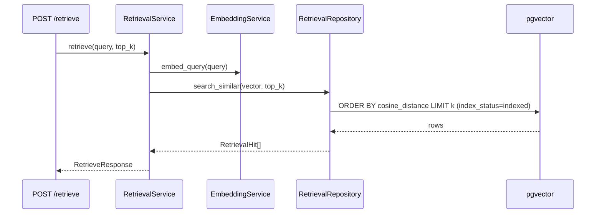
```mermaid
sequenceDiagram
  participant API as POST /retrieve
  participant RS as RetrievalService
  participant EMB as EmbeddingService
  participant RR as RetrievalRepository
  participant PG as pgvector
  API->>RS: retrieve(query, top_k)
  RS->>EMB: embed_query(query)
  RS->>RR: search_similar(vector, top_k)
  RR->>PG: ORDER BY cosine_distance LIMIT k (index_status=indexed)
  PG-->>RR: rows
  RR-->>RS: RetrievalHit[]
  RS-->>API: RetrieveResponse
```

**Multi-agent request** (default mode, no `/command`)
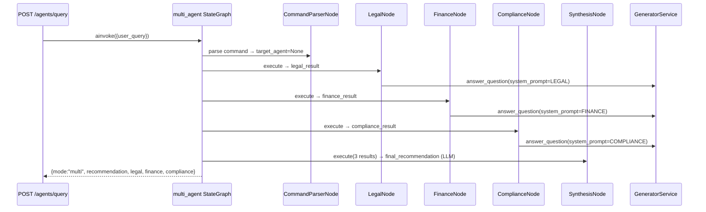
```mermaid
sequenceDiagram
  participant API as POST /agents/query
  participant G as multi_agent StateGraph
  participant CP as CommandParserNode
  participant L as LegalNode
  participant F as FinanceNode
  participant C as ComplianceNode
  participant S as SynthesisNode
  participant GEN as GeneratorService
  API->>G: ainvoke({user_query})
  G->>CP: parse command → target_agent=None
  G->>L: execute → legal_result
  L->>GEN: answer_question(system_prompt=LEGAL)
  G->>F: execute → finance_result
  F->>GEN: answer_question(system_prompt=FINANCE)
  G->>C: execute → compliance_result
  C->>GEN: answer_question(system_prompt=COMPLIANCE)
  G->>S: execute(3 results) → final_recommendation (LLM)
  G-->>API: {mode:"multi", recommendation, legal, finance, compliance}
```

With a `/legal` (or `/finance`/`/compliance`) prefix, `CommandParserNode` sets `target_agent` and the
conditional edges route straight to that single node → `END`, returning `{mode:"single", agent, response}`.

---

## 11. Current Project Workflow (full lifecycle + classes)

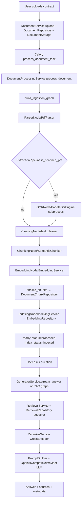
```mermaid
flowchart TB
  A[User uploads contract] --> B[DocumentService.upload + DocumentRepository + DocumentStorage]
  B --> C[Celery process_document_task]
  C --> D[DocumentProcessingService.process_document]
  D --> E[build_ingestion_graph]
  E --> F[ParserNode/PdfParser]
  F --> G{ExtractionPipeline.is_scanned_pdf}
  G -- yes --> H[OCRNode/PaddleOcrEngine subprocess]
  G -- no --> I[CleaningNode/text_cleaner]
  H --> I
  I --> J[ChunkingNode/SemanticChunker]
  J --> K[EmbeddingNode/EmbeddingService]
  K --> L[finalize_chunks → DocumentChunkRepository]
  L --> M[IndexingNode/IndexingService → EmbeddingRepository]
  M --> N[Ready: status=processed, index_status=indexed]
  N --> O[User asks question]
  O --> P[GeneratorService.stream_answer or RAG graph]
  P --> Q[RetrievalService + RetrievalRepository pgvector]
  Q --> R[RerankerService CrossEncoder]
  R --> S[PromptBuilder + OpenAICompatibleProvider LLM]
  S --> T[Answer + sources + metadata]
```

Progress across ingestion is written to Redis by `IngestionProgressService` (via the graph's
`on_stage` hook) and surfaced through `GET /documents/{id}/progress`, which the `IngestionProgress`
React component polls.

---

## 12. Design Patterns

| Pattern | Where | Why |
|---|---|---|
| **Layered architecture** | routers → services → repositories → models | Separation of concerns, testability |
| **Repository** | `app/repositories/*` | Isolate all persistence/SQL; swap/mocks |
| **Dependency Injection** | FastAPI `Depends`, service constructors | Loose coupling, testability |
| **Service layer / single source of truth** | `app/services/*` | Business logic reused by nodes/agents/routers with zero duplication |
| **Factory** | `get_llm_provider`, service `get_*_service`, `create_app` | Central construction from config |
| **Strategy** | LLM providers behind `LLMProvider` Protocol; `RiskClassifier` Protocol; extraction (digital vs OCR) | Interchangeable implementations |
| **Adapter/Wrapper** | LangGraph nodes wrapping services; `OpenAICompatibleProvider` adapting OpenAI/Groq/NIM | Uniform interface over heterogeneous back-ends |
| **Pipeline / Chain (state machine)** | LangGraph `StateGraph` (ingestion, rag) | Composable, retryable, conditional stages |
| **Singleton (cached)** | `@lru_cache` on settings, embedding/reranker/LLM/progress/langfuse | Expensive resources loaded once per process |
| **Template Method** | `BaseAgent._rag_answer`; `BaseGraphAgent.execute` contract | Shared behavior with specialized steps |
| **DTO / Schema mapping** | Pydantic `schemas/*` | Validation + decoupling API from ORM |
| **Observer / callback** | `on_stage` progress hook; Langfuse `trace_node` | Cross-cutting instrumentation without touching logic |
| **Producer/Consumer (task queue)** | Celery + Redis | Offload long ingestion from the request path |
| **Null Object / graceful degradation** | `LangfuseService` no-op when disabled; `IngestionProgressService` no-op without Redis | Optional dependencies never break the app |

---

## 13. Current Limitations

**Placeholders / stubs (✗)**
- `graphs/graph_builder.py` `GraphBuilder.build()` raises `NotImplementedError`; unused
  (misleading name).
- `tools/` + `BaseTool` — contract only, no concrete tools.
- Frontend `Supervision.tsx`, `AgentDetail.tsx` — exist but **not routed**; unused chart
  components (`MonthlyBarChart`, `CategoryDonut`, `StatSparkline`) and most of `mock.ts`.

**Partial / temporary (⚠)**
- Chat exists in **three** paths (`/chat/query` via RAG graph, `/chat/stream` direct, conversation
  messages) — the RAG **graph** is only used by `/chat/query`; the UI uses `/chat/stream`
  (bypasses LangGraph).
- Multi-agent graph (`/agents/query`) is a real LangGraph `StateGraph` (Legal/Finance/Compliance/
  Synthesis nodes), wired into the Consultation page via **slash commands** (`/legal`, `/finance`,
  `/compliance`, `/synthese`). Plain messages still use the streaming RAG path.
- Multi-agent agents run **sequentially** (not parallel) because the request's single `AsyncSession`
  is not concurrency-safe; true parallelism would need per-agent sessions.
- RAG-graph `EmbeddingNode` is a structural no-op for queries.
- Frontend `DocumentItem.type`/`agents` are **hardcoded placeholders** in `documents.ts`.
- Streaming chat is kept in account-partitioned browser history, but streamed turns are **not yet
  persisted in backend `messages`**; the separate conversation API supports DB persistence.
- History "period" filter and Consultation paperclip are non-functional UI.
- Settings profile is read-only (no update endpoint).

**Recently hardened (production-readiness pass)**
- ✓ Q→A reliability: `stream_answer` can no longer produce a blank reply (blocking fallback +
  no-answer fallback + `answer` in the `done` event; the frontend renders it if no fragments
  arrived).
- ✓ Provider layer: `BaseLLMProvider` + `OpenAIProvider`/`GroqProvider`/`NvidiaProvider`/
  `OpenRouterProvider`; OpenRouter is ready — set `LLM_PROVIDER=openrouter` + `OPENROUTER_API_KEY`
  (no code changes). Bounded retries on transient errors.
- ✓ Enterprise error handling: consistent `{detail, code, retryable}` envelope; validation and
  catch-all handlers; no stack traces/technical terms exposed to users.
- ✓ LangGraph: shared transient-only retry policy across all three graphs.
- ✓ Multi-agent orchestration migrated from the hand-rolled `AgentOrchestrator`/`IntentRouter` to a
  real LangGraph `StateGraph` (`build_multi_agent_graph`): Legal/Finance/Compliance/Synthesis are
  graph nodes with conditional `/command` routing; `orchestrator.py` + `placeholder.py` removed.
  The former keyword detector is retained only behind `DomainGuardService` for pre-generation scope
  validation; it no longer dispatches agents.
- ✓ Explicit specialist commands refuse out-of-domain questions before retrieval or provider calls,
  while `/synthese` keeps its intended cross-domain behavior.
- ✓ Per-user isolation: migration 009 owns documents/conversations; endpoint, service, repository,
  full-document and library-wide RAG paths are JWT-owner scoped; foreign UUIDs return `404`.
  Frontend query caches are cleared on account changes and local chat history is partitioned by
  user id. A/B regression tests cover direct-resource and retrieval IDOR boundaries.
- ✓ Resumable chat: normal and slash-agent questions run as independent Celery jobs; Redis retains
  owner-scoped event history for 24 hours and Consultation reconnects from its persisted job id.
- ✓ Generated PDFs are persisted outside chat in an owner-scoped library and can be filtered by
  their source contract.
- ✓ Contract analysis is a reconnectable Celery job with owner-scoped Redis status/result storage;
  browser navigation and refresh do not cancel generation.

**Technical debt**
- Default `JWT_SECRET` in config must be overridden in production; CORS is fully open in dev.
- Stale docstrings ("future"/"architecture preparation") on live components (`GraphState`,
  `BaseGraphAgent`).
- Denormalized `chunk_embeddings` (filename/chunk_text duplicated) — intentional for retrieval
  speed but a consistency risk on edits.
- `askQuestion` (non-streaming client) is dead code.

---

## 14. Roadmap (grounded in the current code)

**✓ Already implemented**
- Auth (register/login/me, JWT, PBKDF2), protected routers.
- PDF upload + local storage; async ingestion via Celery/Redis with live progress.
- Digital parse (PyMuPDF) + conditional PaddleOCR (isolated subprocess).
- Cleaning, semantic chunking, embeddings (bge-m3), pgvector storage + HNSW.
- Retrieval (cosine Top-K), CrossEncoder reranking, grounded generation (+ streaming SSE).
- Conversation persistence + memory; LegalAgent + structured/rule-based risk; Langfuse tracing.
- Redis-backed reconnectable chat/agent streaming that survives browser navigation and refresh.
- Persistent generated-PDF library with global and per-contract views.
- Strict user ownership for documents/conversations and inherited isolation for chunks, vectors,
  analyses and messages; owner-scoped RAG/agents plus account-partitioned frontend caches/history.
- LangGraph ingestion (production), RAG graph, and **multi-agent graph** (Legal/Finance/Compliance/
  Synthesis nodes with `/command` routing); React SPA (dashboard, documents, chat, analysis,
  history, settings).

**⚠ Partially implemented**
- Multi-agent graph (`/agents/query`) is real LangGraph, wired into Consultation via slash commands;
  agents run sequentially (single-session constraint).
- RAG graph used only by `/chat/query`; UI uses direct streaming.
- Conversation messages remain browser-local; Redis job events expire after 24 hours and are not a
  permanent server-side conversation archive.
- Generic `GraphBuilder` (stub).

**✗ Not implemented**
- Organization/workspace tenancy and administrator cross-user access (current isolation is strictly
  one account per ownership boundary).
- Concrete LangGraph tools.
- Streaming conversation-message endpoint; true parallel multi-agent (per-agent sessions).
- Profile update, Supervision/AgentDetail pages, analytics charts wired to real data.

**Recommended next steps (logical order):**
1. **Unify chat persistence** — write completed Redis job results into the SQL conversation/message
   tables so history follows users across devices and outlives the 24-hour event TTL.
2. **Multi-agent UI** — done for Consultation (slash commands + synthesis with the 3 detailed
   analyses). Remaining: surface it on the Analysis page too if useful.
3. **Harden production config** — real `JWT_SECRET`, scoped CORS, secrets management.
4. **Finish/trim frontend** — route or delete Supervision/AgentDetail, wire charts to real
   metrics, remove dead mock/`askQuestion`.
5. **Optional:** migrate `/chat/stream` onto a streaming-capable LangGraph path to consolidate on
   one orchestration model.

---

## 15. Final Architecture Diagram

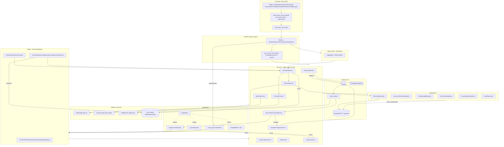
```mermaid
flowchart TB
  subgraph FE[Frontend - React SPA]
    PAGES[Pages: Dashboard/Documents/Generated Documents/Consultation/Analysis/History/Settings/Login]
    RQ[React Query cache cleared on account switch + AuthContext]
    AX[Axios /api + fetch SSE]
  end

  subgraph BE[FastAPI backend /api/v1]
    RT[Routers: auth/health/documents/retrieval/chat/agents]
    DEP[get_current_user derives immutable owner id / get_db]
  end

  subgraph SVC[Services - single source of truth]
    DOC[DocumentService]
    DPS[DocumentProcessingService]
    IDX[IndexingService]
    RETS[RetrievalService]
    RER[RerankerService]
    GEN[GeneratorService]
    CONV[ConversationService]
    AUTH[AuthService]
    PROG[IngestionProgressService]
    LF[LangfuseService]
  end

  subgraph REPO[Repositories]
    DR[DocumentRepository]
    CR[DocumentChunkRepository]
    ER[EmbeddingRepository]
    RR[RetrievalRepository]
    COR[ConversationRepository]
    UR[UserRepository]
  end

  subgraph LG[LangGraph]
    IG[ingestion StateGraph]
    RG[rag StateGraph]
    MAG[multi_agent StateGraph]
    ST[GraphState]
    GBx[GraphBuilder x stub]
  end

  subgraph ND[Nodes - BaseGraphAgent]
    N1[Parser/OCR/Cleaning/Chunking/Embedding/Indexing]
    N2[Retrieval/Reranker/Generator]
    N3[CommandParser/Legal/Finance/Compliance/Synthesis]
  end

  subgraph AG[Legacy agent - BaseAgent]
    LEG[LegalAgent + RiskClassifier]
  end

  subgraph AI[Models / External]
    EMB[FastEmbed bge-m3]
    RKM[CrossEncoder bge-reranker]
    OCRE[PaddleOCR subprocess]
    LLM[(LLM: NVIDIA NIM/OpenAI/Groq)]
  end

  subgraph INFRA[Infrastructure]
    PG[(PostgreSQL 16 + pgvector)]
    REDIS[(Redis)]
    CELERY[Celery worker]
    FS[[storage/documents]]
  end

  PAGES --> RQ --> AX --> RT --> DEP --> SVC
  SVC --> REPO
  REPO -- owner-scoped SQL --> PG
  DOC --> FS
  DOC -- enqueue --> REDIS --> CELERY --> DPS --> IG
  IG --> ND
  RG --> ND
  MAG --> ND
  ND --> SVC
  IG -. traces .-> LF
  RG -. traces .-> LF
  MAG -. traces .-> LF
  DPS -- progress --> PROG --> REDIS
  RT --> AG
  RT -- /agents/query --> MAG
  AG --> GEN
  N2 --> GEN
  N3 --> GEN
  GEN --> RETS --> RR --> PG
  GEN --> RER --> RKM
  RETS --> EMB
  IDX --> EMB
  CELERY --> OCRE
  N3 -- synthesis --> LLM
  GEN -- HTTP --> LLM
  ST -.shared.- IG
  ST -.shared.- RG
  ST -.shared.- MAG
```
